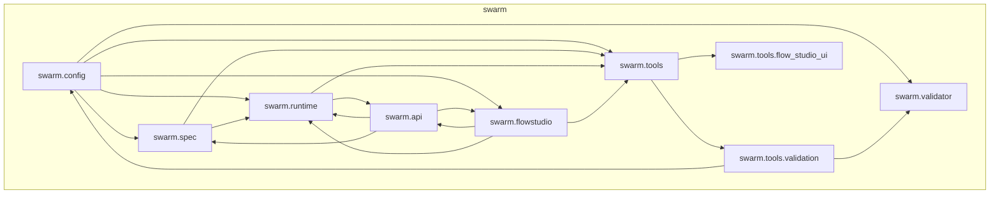
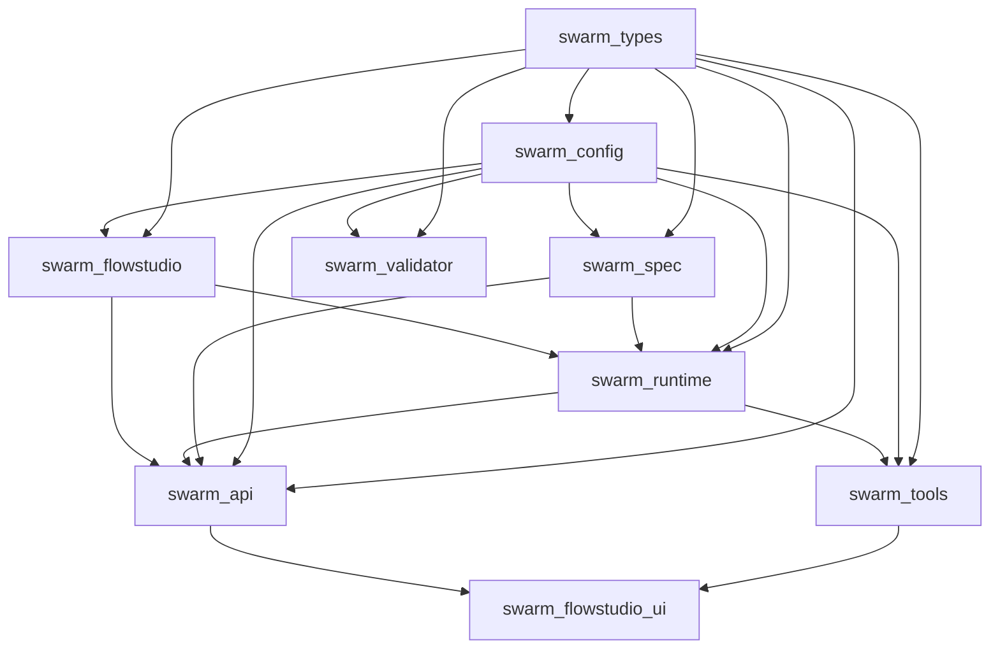

# Flow Studio Swarm - Modularization Analysis Report

## Executive Summary

This report analyzes the flow-studio-swarm codebase and provides recommendations for modularizing the project into logical crates/modules. The project is a complex agentic SDLC orchestration system with Python core, TypeScript UI, and Rust components.

## Current Architecture Overview

### Technology Stack
- **Primary Language**: Python 3.13+
- **UI Framework**: TypeScript (Node.js 20+)
- **Backend Framework**: FastAPI
- **Database**: DuckDB (for stats/projection)
- **Additional**: Rust (handlers/health.rs)

### Project Structure
```
flow-studio-swarm/
├── src/                          # Rust handlers (minimal)
├── swarm/                         # Main Python package
│   ├── api/                   # FastAPI REST API server
│   ├── config/                 # Configuration management
│   ├── flowstudio/             # Flow Studio core business logic
│   ├── runtime/                 # Runtime execution engine
│   ├── spec/                   # Spec system (flows, stations, templates)
│   ├── tools/                  # CLI tools and utilities
│   ├── validator/              # YAML validation
│   └── flow_studio_ui/       # TypeScript UI
├── packages/
│   └── selftest-core/         # Extracted package (already modular)
├── docs/                        # Documentation
├── tests/                       # Test suite
├── examples/                    # Example runs
├── observability/               # Observability configs
└── specs/                       # Spec ledger
```

---

## Component Analysis

### 1. API Layer (`swarm/api/`)

**Responsibilities**: REST API endpoints for spec management, run control, and system health

**Key Files**:
- [`server.py`](swarm/api/server.py:1) - Main FastAPI application factory
- [`asgi.py`](swarm/api/asgi.py:1) - ASGI entry point
- [`routes/`](swarm/api/routes/) - Modular route handlers
  - `specs.py` - Template and flow graph endpoints
  - `runs.py` - Run control (CRUD, pause, resume, interrupt)
  - `events.py` - SSE streaming for real-time events
  - `wisdom.py` - Wisdom/aggregation endpoints
  - `compile.py` - Compilation preview
  - `facts.py`, `evolution.py`, `boundary.py`, `db.py`, `settings.py`, `preview.py`, `tours.py`
- [`services/`](swarm/api/services/) - Business logic layer
  - `spec_manager.py` - Spec loading and caching
  - `run_state.py` - Run state management
  - `run_artifacts.py` - Artifact inspection
  - `run_inspector.py` - Run listing and analysis
  - `validation_service.py` - Validation orchestration

**Dependencies**:
- `swarm.runtime.*` - Storage, stats DB, run tailer
- `swarm.spec.*` - Spec compiler and loader
- `swarm.config.*` - Flow registry, model/tool profiles
- `swarm.flowstudio.*` - Core business logic
- FastAPI, pydantic - Web framework

**Modularization Recommendation**: **Extract as separate package** `swarm-api`

---

### 2. Config Management (`swarm/config/`)

**Responsibilities**: Centralized configuration for agents, flows, models, tools, profiles, and packs

**Key Files**:
- [`model_registry.py`](swarm/config/model_registry.py:1) - Model configuration resolution
- [`tool_profiles.py`](swarm/config/tool_profiles.py:1) - Tool profile resolution
- [`flow_registry.py`](swarm/config/flow_registry.py:1) - Flow definition loading
- [`pack_registry.py`](swarm/config/pack_registry.py:1) - Pack runtime adapter registry
- [`profile_registry.py`](swarm/config/profile_registry.py:1) - Profile management
- [`runtime_config.py`](swarm/config/runtime_config.py:1) - Runtime settings
- [`runs_retention_config.py`](swarm/config/runs_retention_config.py:1) - Run retention policy
- [`agents/`](swarm/config/agents/) - Agent configurations (YAML)
- [`flows/`](swarm/config/flows/) - Flow configurations (YAML)
- [`packs/`](swarm/config/packs/) - Pack system (Python modules)
- [`tours/`](swarm/config/tours/) - Tour configurations

**Dependencies**:
- `swarm.spec.*` - Station specs for validation
- `swarm.runtime.*` - Runtime components
- YAML, pydantic - Configuration parsing

**Modularization Recommendation**: **Extract as separate package** `swarm-config`

---

### 3. Flow Studio Core (`swarm/flowstudio/`)

**Responsibilities**: Framework-agnostic business logic for Flow Studio

**Key Files**:
- [`core.py`](swarm/flowstudio/core.py:1) - Core business logic (flows, agents, artifacts, graphs)
- [`config.py`](swarm/flowstudio/config.py:1) - Flow Studio configuration
- [`schema.py`](swarm/flowstudio/schema.py:1) - Data schemas

**Dependencies**:
- `swarm.config.flow_registry` - Flow definitions
- `swarm.config.model_registry` - Model registry
- `swarm.runtime.storage` - Run storage
- `swarm.runtime.statsdb` - Stats database
- `swarm.tools.run_inspector` - Run inspection
- `swarm.tools.status_provider` - Status provider

**Modularization Recommendation**: **Extract as separate package** `swarm-flowstudio`

---

### 4. Runtime Engine (`swarm/runtime/`)

**Responsibilities**: Stepwise flow execution, routing, LLM backends, and observability

**Key Subdirectories**:
- [`engines/`](swarm/runtime/engines/) - LLM backend implementations
  - `base.py` - Base engine interface
  - `factory.py` - Engine factory
  - `claude/` - Claude Agent SDK integration
    - `cli_runner.py`, `sdk_runner.py`, `session_runner.py`
    - `engine.py`, `router.py`, `prompt_builder.py`, `envelope.py`, `spec_adapter.py`, `stubs.py`
  - `gemini.py` - Gemini backend
  - `models.py` - Engine models
- [`routing/`](swarm/runtime/routing/) - Routing logic
  - `base.py`, `graph_router.py`, `step_router.py`
  - `driver.py`, `navigator.py`, `utility_candidates.py`
- [`stepwise/`](swarm/runtime/stepwise/) - Stepwise orchestration
  - `orchestrator.py` - Main orchestrator (1583 lines, complex)
  - `engine_runner.py`, `envelope.py`, `graph_bridge.py`, `models.py`, `node_resolver.py`
  - `receipt_compat.py`, `routing.py`, `spec_facade.py`
  - `types.py`, `routing/driver.py`, `routing/navigator.py`, `routing/utility_candidates.py`
- [`transports/`](swarm/runtime/transports/) - Transport adapters
  - `claude_sdk_transport.py`, `port.py`
- [`types/`](swarm/runtime/types/) - Shared type definitions
  - `run_types.py`, `state_types.py`, `routing_types.py`, `handoff.py`, `tool_call.py`, `audit.py`, `macro_types.py`, `agent_types.py`
- [`spec_system/`](swarm/runtime/spec_system/) - Spec system bridge
  - `bridge.py`, `canonical.py`
- [`statsdb/`](swarm/runtime/statsdb/) - DuckDB integration
  - `db.py`, `queries.py`, `ingestion.py`, `models.py`, `rebuild.py`, `versions.py`, `cli.py`, `events.py`
- [`_claude_sdk/`](swarm/runtime/_claude_sdk/) - Claude SDK adapter
  - `sdk_import.py`, `session.py`, `options.py`, `policy.py`, `schemas.py`, `hooks.py`, `telemetry.py`, `compat.py`, `shims.py`
- [`storage.py`](swarm/runtime/storage.py) - File system operations
- [`db.py`](swarm/runtime/db.py) - Database interface (statsdb alias)
- [`service.py`](swarm/runtime/service.py) - Run service singleton
- [`run_tailer.py`](swarm/runtime/run_tailer.py) - Event ingestion
- [`autonomous.py`](swarm/runtime/autonomous.py) - Autonomous execution
- [`orchestrator.py`](swarm/runtime/orchestrator.py:1) - Legacy orchestrator shim

**Dependencies**:
- `swarm.config.*` - Configuration registries
- `swarm.spec.*` - Spec system
- `swarm.tools.artifact_manager` - Artifact management
- `swarm.validator.*` - Validation
- DuckDB, httpx - External dependencies

**Modularization Recommendation**: **Extract as separate package** `swarm-runtime`

---

### 5. Spec System (`swarm/spec/`)

**Responsibilities**: Flow and station specification, compilation, and validation

**Key Subdirectories**:
- [`compiler/`](swarm/spec/compiler/) - Spec compiler
  - `builder.py` - Step plan builder (467 lines)
  - `facade.py` - Spec compiler facade (393 lines)
  - `models.py` - Compiler models
  - `prompt_parts.py` - Prompt assembly
  - `intent_adapters.py` - Intent adaptation
- [`manager/`](swarm/spec/manager/) - Spec manager
  - `core.py`, `compile.py`, `errors.py`, `etag.py`, `git.py`, `io.py`, `models.py`, `schemas.py`, `validate.py`, `overlay.py`, `paths.py`
- [`flows/`](swarm/spec/flows/) - Flow definitions (YAML)
- [`stations/`](swarm/spec/stations/) - Station definitions (YAML + JSON)
- [`fragments/`](swarm/spec/fragments/) - Reusable prompt fragments
- [`schemas/`](swarm/spec/schemas/) - JSON schemas
- [`types.py`](swarm/spec/types.py) - Type definitions
- [`loader.py`](swarm/spec/loader.py) - Spec loading utilities
- [`compiler_legacy.py`](swarm/spec/compiler_legacy.py:1) - Legacy compiler

**Dependencies**:
- `swarm.config.*` - Model/tool registries
- `swarm.config.pack_registry` - Pack registry
- YAML, jsonschema - Schema validation
- `swarm.runtime.router` - Flow graph
- `swarm.runtime.types` - Shared types

**Modularization Recommendation**: **Extract as separate package** `swarm-spec`

---

### 6. Tools Layer (`swarm/tools/`)

**Responsibilities**: CLI utilities, validation, code generation, and workflow management

**Key Files** (70+ files):
- [`validate_swarm.py`](swarm/tools/validate_swarm.py:1) - Main validation entry point
- [`flow_studio_fastapi.py`](swarm/tools/flow_studio_fastapi.py:1) - FastAPI app factory
- [`gen_adapters.py`](swarm/tools/gen_adapters.py:1) - Adapter generation
- [`gen_flows.py`](swarm/tools/gen_flows.py:1) - Flow generation
- [`selftest.py`](swarm/tools/selftest.py:1) - Selftest execution
- [`demo_stepwise_run.py`](swarm/tools/demo_stepwise_run.py:1) - Demo runner
- [`artifact_manager.py`](swarm/tools/artifact_manager.py:1) - Artifact management
- [`control_plane.py`](swarm/tools/control_plane.py:1) - Control plane interface
- [`flows_help.py`](swarm/tools/flows_help.py:1) - Flow help CLI
- [`profile_save.py`](swarm/tools/profile_save.py:1) - Profile management
- [`profile_load.py`](swarm/tools/profile_load.py:1) - Profile loading
- [`profile_diff.py`](swarm/tools/profile_diff.py:1) - Profile diffing
- [`run_inspector.py`](swarm/tools/run_inspector.py:1) - Run inspection
- [`record_event.py`](swarm/tools/record_event.py:1) - Event recording
- [`runs_gc.py`](swarm/tools/runs_gc.py:1) - Runs garbage collection
- [`wisdom_summarizer.py`](swarm/tools/wisdom_summarizer.py:1) - Wisdom summarization
- [`wisdom_aggregate_runs.py`](swarm/tools/wisdom_aggregate_runs.py:1) - Wisdom aggregation
- [`vendor_agent_sdk.py`](swarm/tools/vendor_agent_sdk.py:1) - SDK vendoring
- [`flow_studio/`](swarm/tools/flow_studio/) - Flow Studio UI (TypeScript)
- [`validation/`](swarm/tools/validation/) - Validation framework

**Dependencies**:
- `swarm.config.*` - Configuration
- `swarm.spec.*` - Spec system
- `swarm.runtime.*` - Runtime
- `swarm.validator.*` - Validation
- `swarm.flowstudio.*` - Core logic
- `swarm.tools.run_inspector` - Run inspection
- `swarm.tools.status_provider` - Status provider
- pytest, yaml, jsonschema - Testing/parsing

**Modularization Recommendation**: **Extract as separate package** `swarm-tools`

---

### 7. Validator Framework (`swarm/validator/`)

**Responsibilities**: YAML validation and error handling

**Key Files**:
- [`__init__.py`](swarm/validator/__init__.py:1) - Public API
- [`errors.py`](swarm/validator/errors.py:1) - Error types
- [`yaml.py`](swarm/validator/yaml.py:1) - YAML parser

**Dependencies**:
- Minimal - Only standard library + pydantic

**Modularization Recommendation**: **Extract as separate package** `swarm-validator`

---

### 8. Flow Studio UI (`swarm/tools/flow_studio_ui/`)

**Responsibilities**: TypeScript UI for Flow Studio

**Key Files**:
- [`src/`](swarm/tools/flow_studio_ui/src/) - TypeScript source
  - `main.ts`, `domain.ts`, `state.ts`, `graph.ts`, `details.ts`
  - `inventory_counts.ts`, `boundary_review.ts`, `run_control.ts`
  - `layout_spec.ts`, `governance_ui.ts`, `teaching_mode.ts`
  - `tours.ts`, `ui_fragments.ts`, `utils.ts`
- [`js/`](swarm/tools/flow_studio_ui/js/) - Compiled JavaScript
- [`index.html`](swarm/tools/flow_studio_ui/index.html) - Main HTML
- [`package.json`](swarm/tools/flow_studio_ui/package.json) - NPM configuration
- [`tsconfig.json`](swarm/tools/flow_studio_ui/tsconfig.json) - TypeScript config

**Dependencies**:
- FastAPI backend (via HTTP API)
- TypeScript ecosystem

**Modularization Recommendation**: **Extract as separate package** `swarm-flowstudio-ui` or `flow-studio-ui`

---

### 9. Existing Modular Package (`packages/selftest-core/`)

**Status**: Already extracted as separate Python package

**Structure**:
```
selftest-core/
├── pyproject.toml          # Package configuration
├── src/
│   └── selftest_core/
│       ├── __init__.py
│       ├── cli.py
│       ├── config.py
│       ├── doctor.py
│       ├── reporter.py
│       └── runner.py
└── tests/
```

**Modularization Recommendation**: **Keep as-is** (already well-structured)

---

## Current Dependency Map



**Key Dependency Patterns**:
1. **Bidirectional**: `swarm/runtime` ↔ `swarm/config` ↔ `swarm/spec`
2. **Unidirectional**: `swarm/api` → `swarm/runtime`, `swarm/flowstudio`, `swarm/tools`
3. **Tool-specific**: `swarm/tools` → `swarm/tools/validation`, `swarm/tools/flow_studio_ui`

---

## Proposed Modularization Strategy

### Phase 1: Core Package Extraction

#### 1.1 Extract `swarm-config` Package
**Purpose**: Centralized configuration management

**Structure**:
```
swarm-config/
├── pyproject.toml
├── src/
│   └── swarm_config/
│       ├── __init__.py
│       ├── model_registry.py
│       ├── tool_profiles.py
│       ├── flow_registry.py
│       ├── pack_registry.py
│       ├── profile_registry.py
│       ├── runtime_config.py
│       ├── runs_retention_config.py
│       └── agents/flows/packs/tours/  (config data)
└── tests/
```

**Justification**:
- Clear separation of concerns (configuration vs. execution)
- Can be versioned independently
- Reusable across projects
- Minimal external dependencies

**Migration Path**:
1. Create `packages/swarm-config/` directory
2. Move `swarm/config/*` to `packages/swarm-config/src/swarm_config/`
3. Create `pyproject.toml` with proper dependencies
4. Update imports across codebase: `from swarm.config.*` → `from swarm_config.*`
5. Add re-exports in `swarm/config/__init__.py` for backward compatibility

---

#### 1.2 Extract `swarm-spec` Package
**Purpose**: Flow and station specification system

**Structure**:
```
swarm-spec/
├── pyproject.toml
├── src/
│   └── swarm_spec/
│       ├── __init__.py
│       ├── types.py
│       ├── loader.py
│       ├── compiler/
│       │   ├── __init__.py
│       │   ├── builder.py
│       │   ├── facade.py
│       │   ├── models.py
│       │   ├── prompt_parts.py
│       │   └── intent_adapters.py
│       ├── manager/
│       │   ├── __init__.py
│       │   ├── core.py, compile.py, errors.py, etag.py, git.py
│       │   ├── io.py, models.py, schemas.py, validate.py
│       │   ├── overlay.py, paths.py
│       └── flows/stations/fragments/schemas/
└── tests/
```

**Justification**:
- Spec system is domain-logic (flows, stations, templates)
- Independent of runtime implementation
- Can evolve without affecting execution engine
- Clear API boundaries

**Migration Path**:
1. Create `packages/swarm-spec/` directory
2. Move `swarm/spec/*` to `packages/swarm-spec/src/swarm_spec/`
3. Create `pyproject.toml` with dependencies
4. Update imports: `from swarm.spec.*` → `from swarm_spec.*`
5. Add re-exports in `swarm/spec/__init__.py`

---

#### 1.3 Extract `swarm-runtime` Package
**Purpose**: Stepwise execution engine and routing

**Structure**:
```
swarm-runtime/
├── pyproject.toml
├── src/
│   └── swarm_runtime/
│       ├── __init__.py
│       ├── types/
│       ├── engines/
│       │   ├── __init__.py
│       │   ├── base.py, factory.py, models.py
│       │   ├── claude/
│       │   │   ├── cli_runner.py, sdk_runner.py, session_runner.py
│       │   │   ├── engine.py, router.py, prompt_builder.py
│       │   │   ├── envelope.py, spec_adapter.py, stubs.py
│       │   └── gemini.py
│       ├── routing/
│       │   ├── __init__.py
│       │   ├── base.py, graph_router.py, step_router.py
│       │   ├── driver.py, navigator.py, utility_candidates.py
│       ├── stepwise/
│       │   ├── __init__.py
│       │   ├── orchestrator.py, engine_runner.py, envelope.py
│       │   ├── graph_bridge.py, models.py, node_resolver.py
│       │   ├── receipt_compat.py, routing.py, spec_facade.py
│       │   ├── types.py, routing/driver.py
│       │   ├── routing/navigator.py, routing/utility_candidates.py
│       ├── transports/
│       │   ├── __init__.py
│       │   ├── claude_sdk_transport.py, port.py
│       ├── spec_system/
│       │   ├── __init__.py
│       │   ├── bridge.py, canonical.py
│       ├── statsdb/
│       │   ├── __init__.py
│       │   ├── db.py, queries.py, ingestion.py, models.py
│       │   ├── rebuild.py, versions.py, cli.py, events.py
│       ├── _claude_sdk/
│       │   ├── sdk_import.py, session.py, options.py
│       │   ├── policy.py, schemas.py, hooks.py
│       │   ├── telemetry.py, compat.py, shims.py
│       ├── storage.py, db.py, service.py, run_tailer.py
│       ├── autonomous.py, orchestrator.py (shim)
│       └── [other runtime modules]
└── tests/
```

**Justification**:
- Runtime is the most complex subsystem (100+ files)
- Clear separation from configuration and spec
- Can be tested independently
- Enables alternative runtime implementations

**Migration Path**:
1. Create `packages/swarm-runtime/` directory
2. Move `swarm/runtime/*` to `packages/swarm-runtime/src/swarm_runtime/`
3. Create `pyproject.toml` with dependencies (DuckDB, httpx, etc.)
4. Update all imports across codebase
5. Add re-exports in `swarm/runtime/__init__.py`

---

#### 1.4 Extract `swarm-flowstudio` Package
**Purpose**: Framework-agnostic Flow Studio business logic

**Structure**:
```
swarm-flowstudio/
├── pyproject.toml
├── src/
│   └── swarm_flowstudio/
│       ├── __init__.py
│       ├── core.py
│       ├── config.py
│       └── schema.py
└── tests/
```

**Justification**:
- Pure business logic, no framework dependencies
- Can be used by multiple adapters (FastAPI, Flask, CLI)
- Testable in isolation

**Migration Path**:
1. Create `packages/swarm-flowstudio/` directory
2. Move `swarm/flowstudio/*` to `packages/swarm-flowstudio/src/swarm_flowstudio/`
3. Create `pyproject.toml`
4. Update imports: `from swarm.flowstudio.*` → `from swarm_flowstudio.*`

---

#### 1.5 Extract `swarm-tools` Package
**Purpose**: CLI utilities and workflow management tools

**Structure**:
```
swarm-tools/
├── pyproject.toml
├── src/
│   └── swarm_tools/
│       ├── __init__.py
│       ├── validate_swarm.py
│       ├── gen_adapters.py
│       ├── gen_flows.py
│       ├── selftest.py
│       ├── demo_stepwise_run.py
│       ├── artifact_manager.py
│       ├── control_plane.py
│       ├── flows_help.py
│       ├── profile_save.py
│       ├── profile_load.py
│       ├── profile_diff.py
│       ├── run_inspector.py
│       ├── record_event.py
│       ├── runs_gc.py
│       ├── wisdom_summarizer.py
│       ├── wisdom_aggregate_runs.py
│       ├── vendor_agent_sdk.py
│       └── validation/
│           ├── __init__.py
│           ├── cli.py
│           ├── constants.py
│           ├── helpers.py
│           ├── git_helpers.py
│           ├── registry.py
│           ├── runner.py
│           ├── reporting/
│           │   ├── __init__.py
│           │   ├── console_output.py
│           │   ├── json_output.py
│           │   └── markdown_output.py
│           └── validators/
│               ├── __init__.py
│               ├── bijection.py
│               ├── capabilities.py
│               ├── colors.py
│               ├── config_coverage.py
│               ├── flow_references.py
│               ├── flows/
│               │   ├── __init__.py
│               │   ├── agent_validity.py
│               │   ├── documentation.py
│               │   ├── invariants.py
│               │   ├── studio_sync.py
│               │   └── utility_graphs.py
│               ├── frontmatter.py
│               ├── microloops.py
│               ├── prompts.py
│               ├── runbase.py
│               └── skills.py
└── tests/
```

**Justification**:
- Tools are utilities, not core business logic
- Can evolve independently
- Clear CLI entry points

**Migration Path**:
1. Create `packages/swarm-tools/` directory
2. Move `swarm/tools/*` to `packages/swarm-tools/src/swarm_tools/`
3. Create `pyproject.toml`
4. Update imports: `from swarm.tools.*` → `from swarm_tools.*`

---

#### 1.6 Extract `swarm-validator` Package
**Purpose**: YAML validation framework

**Structure**:
```
swarm-validator/
├── pyproject.toml
├── src/
│   └── swarm_validator/
│       ├── __init__.py
│       ├── errors.py
│       └── yaml.py
└── tests/
```

**Justification**:
- Minimal, focused package
- Reusable validation logic
- No external dependencies

**Migration Path**:
1. Create `packages/swarm-validator/` directory
2. Move `swarm/validator/*` to `packages/swarm-validator/src/swarm_validator/`
3. Create `pyproject.toml` with pydantic
4. Update imports: `from swarm.validator.*` → `from swarm_validator.*`

---

#### 1.7 Extract `swarm-api` Package
**Purpose**: REST API server for spec management and run control

**Structure**:
```
swarm-api/
├── pyproject.toml
├── src/
│   └── swarm_api/
│       ├── __init__.py
│       ├── server.py
│       ├── asgi.py
│       ├── routes/
│       │   ├── __init__.py
│       │   ├── specs.py, runs.py, events.py, wisdom.py
│       │   ├── compile.py, facts.py, evolution.py
│       │   ├── boundary.py, db.py, settings.py, preview.py, tours.py
│       └── services/
│           ├── __init__.py
│           ├── spec_manager.py, run_state.py, run_artifacts.py
│           ├── run_inspector.py, validation_service.py
└── tests/
```

**Justification**:
- API layer should be independent
- Can be deployed separately
- Clear FastAPI application boundaries

**Migration Path**:
1. Create `packages/swarm-api/` directory
2. Move `swarm/api/*` to `packages/swarm-api/src/swarm_api/`
3. Create `pyproject.toml` with FastAPI, pydantic
4. Update imports: `from swarm.api.*` → `from swarm_api.*`

---

#### 1.8 Extract `swarm-flowstudio-ui` Package
**Purpose**: TypeScript UI for Flow Studio

**Structure**:
```
swarm-flowstudio-ui/
├── package.json
├── tsconfig.json
├── src/
│   ├── main.ts
│   ├── domain.ts
│   ├── state.ts
│   ├── graph.ts
│   ├── details.ts
│   ├── inventory_counts.ts
│   ├── boundary_review.ts
│   ├── run_control.ts
│   ├── layout_spec.ts
│   ├── governance_ui.ts
│   ├── teaching_mode.ts
│   ├── tours.ts
│   ├── ui_fragments.ts
│   └── utils.ts
├── js/               # Compiled output
├── index.html
└── tests/
```

**Justification**:
- UI is a separate concern
- Can evolve independently
- Clear TypeScript/NPM boundaries

**Migration Path**:
1. Create `packages/swarm-flowstudio-ui/` directory
2. Move `swarm/tools/flow_studio_ui/*` to `packages/swarm-flowstudio-ui/`
3. Keep `package.json`, `tsconfig.json`
4. Update any build scripts

---

### Phase 2: Shared Types Package

#### 2.1 Create `swarm-types` Package
**Purpose**: Shared type definitions across all packages

**Structure**:
```
swarm-types/
├── pyproject.toml
├── src/
│   └── swarm_types/
│       ├── __init__.py
│       ├── run_types.py
│       ├── state_types.py
│       ├── routing_types.py
│       ├── handoff.py
│       ├── tool_call.py
│       ├── audit.py
│       ├── macro_types.py
│       └── agent_types.py
└── tests/
```

**Justification**:
- Eliminates circular dependencies
- Single source of truth for types
- Can evolve independently

**Migration Path**:
1. Create `packages/swarm-types/` directory
2. Extract shared types from `swarm/runtime/types/`
3. Create `pyproject.toml`
4. Update imports across all packages

---

### Phase 3: Root Package Refactoring

#### 3.1 Create `swarm` Metapackage
**Purpose**: Umbrella package for convenient imports

**Structure**:
```
swarm/
├── __init__.py              # Re-exports from sub-packages
├── config/                 # Configuration (moved to swarm-config)
├── spec/                   # Spec system (moved to swarm-spec)
├── runtime/                 # Runtime (moved to swarm-runtime)
├── flowstudio/             # Flow Studio (moved to swarm-flowstudio)
├── tools/                  # Tools (moved to swarm-tools)
├── validator/              # Validator (moved to swarm-validator)
├── api/                    # API (moved to swarm-api)
└── [remaining directories]
```

**Migration Path**:
1. Keep `swarm/` as lightweight metapackage
2. Update `__init__.py` to re-export from extracted packages
3. Remove old code (after migration)

---

## Recommended Final Structure

```
flow-studio-swarm/
├── pyproject.toml              # Root package config
├── packages/                  # All extracted packages
│   ├── swarm-config/          # Configuration management
│   ├── swarm-spec/             # Flow and station specs
│   ├── swarm-runtime/           # Execution engine
│   ├── swarm-flowstudio/       # Flow Studio business logic
│   ├── swarm-tools/            # CLI utilities
│   ├── swarm-validator/         # Validation framework
│   ├── swarm-api/              # REST API server
│   ├── swarm-flowstudio-ui/    # TypeScript UI
│   ├── swarm-types/            # Shared types
│   └── selftest-core/         # (existing)
├── swarm/                     # Umbrella metapackage
│   └── __init__.py          # Re-exports
├── src/                      # Rust components (minimal)
│   └── handlers/
│       └── health.rs
├── docs/                     # Documentation
├── tests/                    # Test suite
├── examples/                 # Example runs
├── observability/           # Observability configs
├── specs/                   # Spec ledger
├── Makefile                  # Build orchestration
└── [other root files]
```

---

## Migration Plan

### Step 1: Create Package Infrastructure
1. Set up monorepo structure with `packages/` directory
2. Create `pyproject.toml` templates for each package
3. Configure workspace tool (e.g., `uv` workspace support)

### Step 2: Extract Core Packages (Order Matters)
**Critical Path**: `swarm-config` must be extracted **first** because:
- `swarm-spec` depends on `swarm.config.*`
- `swarm-runtime` depends on `swarm.config.*`
- `swarm-flowstudio` depends on `swarm.config.*`
- `swarm-tools` depends on `swarm.config.*`
- `swarm-validator` depends on `swarm.config.*`
- `swarm-api` depends on `swarm.config.*`

**Extraction Order**:
1. Extract `swarm-config`
2. Extract `swarm-types` (no dependencies)
3. Extract `swarm-spec`
4. Extract `swarm-runtime`
5. Extract `swarm-flowstudio`
6. Extract `swarm-tools`
7. Extract `swarm-validator`
8. Extract `swarm-api`
9. Extract `swarm-flowstudio-ui`

### Step 3: Update Imports
For each package, update imports from old to new package names:
- `from swarm.config.*` → `from swarm_config.*`
- `from swarm.spec.*` → `from swarm_spec.*`
- `from swarm.runtime.*` → `from swarm_runtime.*`
- `from swarm.flowstudio.*` → `from swarm_flowstudio.*`
- `from swarm.tools.*` → `from swarm_tools.*`
- `from swarm.validator.*` → `from swarm_validator.*`
- `from swarm.api.*` → `from swarm_api.*`

### Step 4: Update Root `pyproject.toml`
- Update to use workspace dependencies
- Configure development mode for local package links

### Step 5: Create Umbrella `swarm/` Package
- Re-export all public APIs from sub-packages
- Add deprecation warnings for old import paths
- Maintain backward compatibility during transition

### Step 6: Update Documentation
- Update `README.md` with new structure
- Update import examples in docs
- Update Makefile targets

### Step 7: Update CI/CD
- Update test paths
- Update build scripts
- Update deployment configurations

---

## Backward Compatibility Strategy

### Phase 1: Compatibility Layer (Recommended)
1. Keep old `swarm/` directory with re-export shims
2. Add deprecation warnings for old imports
3. Support both import paths during transition period
4. Document migration timeline

### Example Compatibility Shim (`swarm/config/__init__.py`):
```python
# swarm/config/__init__.py
import warnings

# Re-export for backward compatibility
from swarm_config.model_registry import *
from swarm_config.tool_profiles import *
from swarm_config.flow_registry import *
from swarm_config.pack_registry import *
from swarm_config.profile_registry import *
from swarm_config.runtime_config import *
from swarm_config.runs_retention_config import *

# Deprecation warnings
warnings.warn(
    "Direct imports from swarm.config.* are deprecated. "
    "Use 'from swarm_config.*' instead. "
    "This shim will be removed in version 3.0.0.",
    DeprecationWarning,
    stacklevel=2
)
```

### Phase 2: Clean Removal (After Transition)
1. Remove old `swarm/config/`, `swarm/spec/`, etc. directories
2. Remove compatibility shims
3. Update root `pyproject.toml`

---

## Inter-Package Dependencies

### Dependency Graph After Extraction


### Managing Shared Dependencies

#### Option A: Runtime Dependencies
- Packages that need runtime deps (`swarm-runtime`, `swarm-api`) should declare them
- Use `uv` workspace to ensure single version

#### Option B: Interface-Based Design
- Define clear interfaces between packages
- Use dependency injection for pluggable components

**Recommendation**: Use `uv` workspace with shared dependency versions

---

## Risk Assessment

### High-Risk Areas
1. **Circular Dependencies**: Current bidirectional dependencies between `swarm/runtime`, `swarm/config`, `swarm/spec`
   - **Mitigation**: Extract `swarm-config` first to break cycles
2. **Tight Coupling**: `swarm/runtime/orchestrator.py` (1583 lines) does too much
   - **Mitigation**: Further modularize stepwise subsystem
3. **Import Complexity**: 154+ files import from `swarm.*` across codebase
   - **Mitigation**: Create clear package boundaries and re-export layer

### Medium-Risk Areas
1. **Tool Directory Size**: 70+ files in `swarm/tools/`
   - **Mitigation**: Already planning extraction
2. **API Surface Area**: Multiple routers and services in `swarm/api/`
   - **Mitigation**: Already planning extraction
3. **Runtime Complexity**: Multiple engines, routing, stepwise subsystems
   - **Mitigation**: Clear package boundaries

### Low-Risk Areas
1. **UI Separation**: TypeScript UI is already well-isolated
2. **Validator**: Minimal package, low impact
3. **Selftest-Core**: Already extracted, proven pattern

---

## Testing Strategy

### Unit Testing
- Each package should have its own test suite
- Use `pytest` with package-scoped tests
- Mock inter-package dependencies

### Integration Testing
- Test package interactions via workspace
- Verify import paths work correctly
- Test backward compatibility shims

### E2E Testing
- Test end-to-end workflows
- Verify all packages work together

---

## Recommendations Summary

### Immediate Actions
1. **Extract `swarm-config` package first** - Breaks circular dependencies
2. **Create `swarm-types` package** - Eliminates type duplication
3. **Use workspace tooling** - `uv` for Python, npm workspaces for TypeScript
4. **Implement compatibility layer** - Support gradual migration
5. **Document migration plan** - Clear communication strategy

### Long-Term Considerations
1. **Monorepo vs Multi-Repo**: Consider separate repositories for major components
2. **Plugin Architecture**: Consider plugin system for engines and validators
3. **API Versioning**: Plan for API versioning across packages
4. **Configuration Management**: Consider hierarchical configuration system

---

## Conclusion

The flow-studio-swarm codebase is well-structured but would benefit significantly from modularization. The proposed strategy extracts 8 core packages with clear boundaries:

1. **swarm-config** - Configuration foundation
2. **swarm-types** - Shared type definitions  
3. **swarm-spec** - Flow and station specifications
4. **swarm-runtime** - Execution engine
5. **swarm-flowstudio** - Business logic layer
6. **swarm-tools** - CLI utilities
7. **swarm-validator** - Validation framework
8. **swarm-api** - REST API server
9. **swarm-flowstudio-ui** - TypeScript UI

This modularization enables:
- Independent versioning and release cycles
- Clearer testing boundaries
- Reduced coupling between components
- Easier onboarding for new contributors
- Potential for multiple deployment scenarios

The migration should be executed incrementally with a compatibility layer to minimize disruption.
