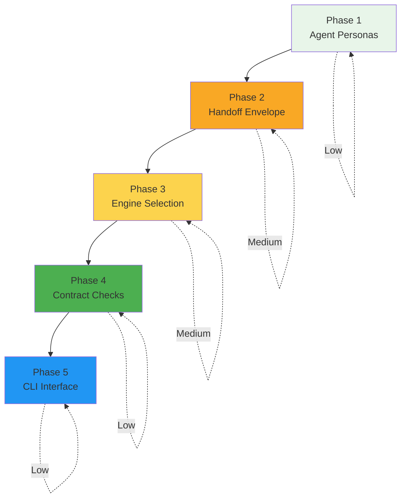

# Phase Feasibility Assessment

## Executive Summary

This document assesses the implementation feasibility for transforming flow-studio-swarm from "demo-capable" to "useful stepwise executor" across 5 phases. All phases are technically feasible with Low to Medium complexity.

## Phase 1 — Make Agent Personas First-Class at Execution Time

### Goal
Every step run is *actually* executed under the agent's system prompt.

### Proposed Changes
- Add a tiny `AgentRegistry` that loads `.claude/agents/<agent>.md` by key
- In `ClaudeStepEngine` / CLI mode: Prefer native "run as agent X" mechanism or inject persona content with delimiter
- Fail fast if agent file is missing

### Feasibility: **LOW**

**Files to Modify:**
- `swarm/runtime/engines.py` - Add `AgentRegistry` class and persona loading
- `swarm/runtime/orchestrator.py` - Pass agent persona to engine
- `swarm/runtime/types.py` - Optional: Add `AgentPersona` dataclass

**Key Findings:**
1. Agent personas exist as markdown files in [`.claude/agents/`](.claude/agents/) with frontmatter (name, description, model, color)
2. The [`StepContext`](swarm/runtime/engines.py:68) dataclass already has `step_agents` tuple
3. [`ClaudeStepEngine._build_prompt()`](swarm/runtime/engines.py:1073) already includes "Assigned Agents" section in prompt
4. No current mechanism loads agent content as system prompts

**Edge Cases & Risks:**
- **Risk**: Agent files may not exist for some step agents (need graceful degradation)
- **Edge Case**: Multiple agents per step (need to decide how to combine personas)
- **Edge Case**: Agent file format variations (need robust parsing)

**Implementation Approach:**
```python
# New class in engines.py
class AgentRegistry:
    def load_persona(self, agent_key: str) -> Optional[str]:
        # Load .claude/agents/<agent>.md
        # Parse frontmatter and return content
        pass

# Modify ClaudeStepEngine._build_prompt()
# Inject persona content before "Instructions" section
if ctx.step_agents:
    persona = agent_registry.load_persona(ctx.step_agents[0])
    if persona:
        lines.insert(position, "## Agent Persona\n" + persona)
```

---

## Phase 2 — Introduce a Handoff Envelope

### Goal
Model swaps and truncation stop being scary. Write structured handoff JSON after each step.

### Proposed Changes
- Write `RUN_BASE/<flow>/handoff/<step_id>.json` after each step
- Include: domain_status, can_further_iteration_help, summary, artifacts, routing_hint
- Use handoff JSON as default history context

### Feasibility: **MEDIUM**

**Files to Modify:**
- `swarm/runtime/engines.py` - Add handoff envelope writing logic
- `swarm/runtime/orchestrator.py` - Update history building to use handoff envelopes
- `swarm/runtime/storage.py` - Optional: Add handoff-specific I/O helpers
- `swarm/runtime/types.py` - Add `HandoffEnvelope` dataclass

**Key Findings:**
1. Current history is a simple `List[Dict[str, Any]]` passed to [`StepContext`](swarm/runtime/engines.py:68)
2. [`GeminiStepEngine._build_prompt()`](swarm/runtime/engines.py:462) and [`ClaudeStepEngine._build_prompt()`](swarm/runtime/engines.py:1073) both include "Previous Steps Context" section
3. No structured handoff mechanism exists
4. RUN_BASE layout is `swarm/runs/<run_id>/<flow_key>/` - need to add `handoff/` subdirectory

**Interaction with Existing Routing:**
- The [`_route()`](swarm/runtime/orchestrator.py:487) method already reads receipt fields like `can_further_iteration_help`
- Handoff envelope would provide these fields explicitly instead of relying on LLM output
- This creates a **contract** between steps rather than implicit expectations

**Edge Cases & Risks:**
- **Risk**: Handoff envelope parsing failures could break history chain
- **Edge Case**: Steps without agents (no handoff to write)
- **Edge Case**: Microloop iterations (multiple handoffs for same step_id)
- **Risk**: Storage location conflicts with existing `llm/` and `receipts/` directories

**Implementation Approach:**
```python
# New dataclass in types.py
@dataclass
class HandoffEnvelope:
    step_id: str
    status: str  # "succeeded", "failed"
    domain_status: str  # e.g., "tests_passing", "code_complete"
    can_further_iteration_help: str  # "yes", "no"
    summary: str  # Concise step summary
    artifacts: List[str]  # Paths to produced artifacts
    routing_hint: Optional[str]  # Suggestion for routing

# Modify engines.py after step execution
def _write_handoff_envelope(ctx: StepContext, result: StepResult):
    envelope = HandoffEnvelope(...)
    handoff_path = ctx.run_base / "handoff" / f"{ctx.step_id}.json"
    handoff_path.write_text(json.dumps(envelope.to_dict()))

# Modify orchestrator.py history building
def _build_history_with_handoffs(run_id: str, flow_key: str) -> List[Dict]:
    handoffs = glob.glob(run_base / "handoff" / "*.json")
    return [parse_handoff(f) for f in sorted(handoffs)]
```

---

## Phase 3 — Wire Per-Step Engine Selection

### Goal
Let steps explicitly choose engines/modes/models.

### Proposed Changes
1. Extend `FlowRegistry._load_flow_steps()` to parse `engine_profile` from YAML
2. Update orchestrator to maintain engine registry and select engine per step

### Feasibility: **MEDIUM**

**Files to Modify:**
- `swarm/config/flow_registry.py` - Add `engine_profile` parsing in [`_load_flow_steps()`](swarm/config/flow_registry.py:195)
- `swarm/runtime/orchestrator.py` - Add engine registry and per-step selection
- `swarm/runtime/engines.py` - May need factory updates for profile-based initialization
- `swarm/config/flows/*.yaml` - Add `engine_profile` fields to step definitions

**Key Findings:**
1. [`EngineProfile`](swarm/config/flow_registry.py:88) class already exists with all needed fields (engine, mode, model, timeout_ms, context_budgets)
2. [`StepDefinition`](swarm/config/flow_registry.py:110) already has `engine_profile` field
3. [`_load_flow_steps()`](swarm/config/flow_registry.py:195) does NOT parse `engine_profile` from YAML - this is the gap
4. [`GeminiStepOrchestrator.__init__()`](swarm/runtime/orchestrator.py:80) accepts single `engine` parameter
5. [`get_step_engine()`](swarm/runtime/engines.py:1944) factory already exists

**Interaction with Existing Engine Initialization:**
- Current orchestrator creates engine once in [`__init__()`](swarm/runtime/orchestrator.py:80)
- Need to change to engine registry pattern: maintain multiple engines, select per step
- [`get_step_engine()`](swarm/runtime/engines.py:1944) factory already supports `profile_id` parameter - can extend

**Edge Cases & Risks:**
- **Risk**: Engine profile validation failures (what if profile specifies invalid engine?)
- **Edge Case**: Steps without engine_profile (need default fallback)
- **Edge Case**: Profile specifies engine not available (graceful degradation)
- **Risk**: Context budget merging complexity (step-level vs profile-level)

**Implementation Approach:**
```python
# Modify flow_registry.py _load_flow_steps()
step_data = step_data.get("engine_profile", {})
engine_profile = None
if step_data.get("engine_profile"):
    engine_profile = EngineProfile(
        engine=step_profile.get("engine", "claude-step"),
        mode=step_profile.get("mode", "stub"),
        model=step_profile.get("model"),
        timeout_ms=step_profile.get("timeout_ms", 300000),
        context_budgets=ContextBudgetOverride(...) if step_profile.get("context_budgets") else None,
    )

# Modify orchestrator.py
class StepwiseOrchestrator:
    def __init__(self, engine_registry: Dict[str, StepEngine]):
        self._engine_registry = engine_registry  # Multiple engines

    def _get_engine_for_step(self, step: StepDefinition) -> StepEngine:
        if step.engine_profile:
            return self._engine_registry.get(step.engine_profile.engine)
        return self._default_engine

# Example YAML addition
steps:
  - id: implement
    engine_profile:
        engine: claude-step
        mode: sdk
        model: claude-opus-4-5-20251101
```

---

## Phase 4 — Add Cheap Contract Checks

### Goal
Stepwise execution fails loudly and fixably. Preflight: Check inputs exist. Postflight: Verify outputs exist and are non-empty. Repair microloop: Re-run same agent once with failure described.

### Feasibility: **LOW**

**Files to Modify:**
- `swarm/runtime/orchestrator.py` - Add pre/postflight checks in [`_execute_single_step()`](swarm/runtime/orchestrator.py:671)
- `swarm/runtime/engines.py` - Optional: Add validation hooks
- `swarm/config/flow_registry.py` - Optional: Add validation metadata to `TeachingNotes`

**Key Findings:**
1. [`TeachingNotes`](swarm/config/flow_registry.py:22) already has `inputs` and `outputs` tuples
2. [`StepContext`](swarm/runtime/engines.py:68) includes `teaching_notes` field
3. No current validation of inputs/outputs
4. Orchestrator already tracks step results in history

**Interaction with Existing Routing:**
- Contract checks would run **before** routing decisions
- Failed preflight could skip step (advance to next)
- Failed postflight could trigger microloop repair
- This creates a **validation layer** around LLM execution

**Edge Cases & Risks:**
- **Risk**: False positives (file exists but is empty/truncated)
- **Risk**: False negatives (file created after check but before LLM writes)
- **Edge Case**: Optional outputs (how to validate?)
- **Edge Case**: Binary artifacts (how to check "non-empty"?)
- **Risk**: Repair microloop infinite loops (need max repair attempts)

**Implementation Approach:**
```python
# Modify orchestrator.py
def _preflight_check(self, step: StepDefinition, run_base: Path) -> bool:
    if step.teaching_notes and step.teaching_notes.inputs:
        for input_path in step.teaching_notes.inputs:
            full_path = run_base / input_path
            if not full_path.exists():
                logger.error("Preflight check failed: %s missing", full_path)
                return False
            if full_path.stat().st_size == 0:
                logger.warning("Preflight check: %s is empty", full_path)
    return True

def _postflight_check(self, step: StepDefinition, result: StepResult, run_base: Path) -> bool:
    if step.teaching_notes and step.teaching_notes.outputs:
        for output_path in step.teaching_notes.outputs:
            full_path = run_base / output_path
            if not full_path.exists():
                logger.error("Postflight check failed: %s missing", full_path)
                return False
            if full_path.stat().st_size == 0:
                logger.error("Postflight check failed: %s is empty", full_path)
                return False
    return True

# Add repair microloop to _execute_single_step()
if not _postflight_check(step, result, run_base):
    if result.status == "succeeded":  # Only repair successful steps
        logger.info("Postflight failed, initiating repair microloop")
        # Re-run with failure description
        repair_result = self._execute_single_step(..., repair_mode=True)
```

---

## Phase 5 — Make "Run SDLC Stepwise" First-Class Interface

### Goal
Graduate from demo to useful executor. Add `swarm/tools/run_stepwise.py` CLI entrypoint accepting `--issue-file` or `--issue-text`, `--flows`, `--engine`, `--mode`. Write raw issue to `RUN_BASE/signal/raw_input.md`.

### Feasibility: **LOW**

**Files to Modify:**
- `swarm/tools/run_stepwise.py` - **NEW FILE** (create from scratch)
- `swarm/runtime/storage.py` - Optional: Add signal/raw_input.md writing helper
- `swarm/runtime/backends.py` - Optional: Add stepwise-specific backend

**Key Findings:**
1. [`demo_stepwise_run.py`](swarm/tools/demo_stepwise_run.py) already exists as reference implementation
2. [`get_backend()`](swarm/runtime/backends.py:1297) factory exists for backend selection
3. [`RunSpec`](swarm/runtime/types.py:62) accepts `params` dict for arbitrary parameters
4. RUN_BASE layout is `swarm/runs/<run_id>/<flow_key>/` - `signal/` already exists

**Interaction with Existing Demo Runner:**
- Can coexist with [`demo_stepwise_run.py`](swarm/tools/demo_stepwise_run.py)
- Could share argument parsing logic
- Uses same backend infrastructure

**Edge Cases & Risks:**
- **Risk**: Issue file too large for prompt context
- **Edge Case**: Both `--issue-file` and `--issue-text` provided (need precedence rules)
- **Edge Case**: No issue provided (interactive mode?)
- **Risk**: Flow validation (what if user specifies non-existent flow?)
- **Edge Case**: Signal flow not in flow_keys (need auto-add?)

**Implementation Approach:**
```python
# New file: swarm/tools/run_stepwise.py
def main():
    parser = argparse.ArgumentParser(description="Run SDLC stepwise with issue input")
    parser.add_argument("--issue-file", help="Path to issue file")
    parser.add_argument("--issue-text", help="Raw issue text")
    parser.add_argument("--flows", default="signal,plan,build", help="Flows to run")
    parser.add_argument("--engine", default="claude-step", help="Engine to use")
    parser.add_argument("--mode", choices=["stub", "sdk", "cli"], help="Engine mode")
    args = parser.parse_args()

    # Read or accept issue
    if args.issue_file:
        issue = Path(args.issue_file).read_text()
    elif args.issue_text:
        issue = args.issue_text
    else:
        parser.error("Either --issue-file or --issue-text required")

    # Write to RUN_BASE/signal/raw_input.md
    run_id = generate_run_id()
    signal_path = Path("swarm/runs") / run_id / "signal"
    signal_path.mkdir(parents=True, exist_ok=True)
    (signal_path / "raw_input.md").write_text(issue)

    # Create spec and start run
    flow_keys = [f.strip() for f in args.flows.split(",")]
    spec = RunSpec(
        flow_keys=flow_keys,
        backend=f"{args.engine}-orchestrator",
        initiator="run-stepwise-cli",
        params={"issue_source": "file" if args.issue_file else "text"},
    )

    backend = get_backend(spec.backend)
    run_id = backend.start(spec)
    print(f"Started run: {run_id}")
```

---

## Legacy Assumptions to Delete

### 1. Rename `GeminiStepOrchestrator` to `StepwiseOrchestrator`

**Feasibility: **LOW**

**Files to Modify:**
- `swarm/runtime/orchestrator.py` - Rename class, add alias

**Risks:**
- **Risk**: Breaking imports in existing code (need search/replace)
- **Risk**: Test files reference old class name
- **Risk**: Documentation references old name

**Implementation Approach:**
```python
# In orchestrator.py
class StepwiseOrchestrator:  # Renamed from GeminiStepOrchestrator
    # ... existing implementation ...

# Add backward compatibility alias
GeminiStepOrchestrator = StepwiseOrchestrator  # Alias for imports
```

### 2. Fix Single-Engine Run Assumption by Parsing `engine_profile`

**Feasibility: LOW** (covered by Phase 3)

This is already addressed in Phase 3. The parsing of `engine_profile` enables per-step engine selection.

### 3. Make "LLM Will Remember to Output Status" a Contract via Handoff Envelope

**Feasibility: LOW** (covered by Phase 2)

This is already addressed in Phase 2. The handoff envelope explicitly includes `status`, `domain_status`, and `can_further_iteration_help` fields.

---

## Recommended Implementation Order



**Rationale:**
1. **Phase 1 first** - Foundation for all other phases; agent personas must be loaded before any step execution
2. **Phase 2 second** - Handoff envelope is needed before contract checks (Phase 4) can validate structured output
3. **Phase 3 third** - Engine selection is independent but benefits from structured handoffs
4. **Phase 4 fourth** - Contract checks depend on having clear expectations (handoffs) and clear outputs
5. **Phase 5 last** - CLI interface is the user-facing entrypoint that ties everything together

**Dependencies:**
- Phase 2 (Handoff) → Enables Phase 4 (Contract Checks)
- Phase 3 (Engine Selection) → Independent but synergistic with Phase 2
- Phase 1 (Agent Personas) → Prerequisite for all execution

---

## Blockers and Risks

### Blockers
**None identified.** All phases are technically feasible with the current architecture.

### Risks

| Phase | Risk | Mitigation |
|--------|-------|------------|
| 1 | Agent file format variations | Implement robust parsing with fallback to agent key only |
| 1 | Multiple agents per step | Document behavior: concatenate personas or use first agent |
| 2 | Handoff parsing failures | Add validation, graceful degradation to raw history |
| 2 | Storage location conflicts | Use `handoff/` subdirectory, avoid conflicts with `llm/` and `receipts/` |
| 3 | Engine profile validation | Add validation at flow load time, clear error messages |
| 3 | Context budget merging | Document resolution cascade: step > flow > profile > global |
| 4 | False positive/negative checks | Use heuristics (file existence + size + recent modification) |
| 5 | Issue size limits | Add truncation with warning, suggest file-based input for large issues |
| All | Breaking changes | Maintain backward compatibility where possible, add deprecation warnings |

---

## Unexpected Findings and Considerations

### 1. Engine Profile Already Exists in Data Model
The [`EngineProfile`](swarm/config/flow_registry.py:88) class is already fully defined with all fields needed for Phase 3. The only missing piece is parsing it from YAML.

### 2. Teaching Notes Already Define Input/Output Contracts
The [`TeachingNotes`](swarm/config/flow_registry.py:22) class already has `inputs` and `outputs` tuples. Phase 4 can leverage this existing metadata.

### 3. Orchestrator Already Supports Microloops
The [`GeminiStepOrchestrator._route()`](swarm/runtime/orchestrator.py:487) method already implements microloop logic with `loop_target`, `loop_condition_field`, and `max_iterations`. Phase 2's handoff envelope will enhance this.

### 4. Multiple Backends Already Exist
The backend registry in [`backends.py`](swarm/runtime/backends.py:1287) already supports multiple backends. Phase 5 can leverage this infrastructure.

### 5. RUN_BASE Layout is Well-Structured
The storage layout is already organized with `llm/`, `receipts/`, and flow-specific subdirectories. Adding `handoff/` is a natural extension.

### 6. Agent Files Use Frontmatter Format
Agent files use YAML frontmatter (name, description, model, color) which is parseable with standard libraries. This makes Phase 1 straightforward.

### 7. StepContext Already Rich
The [`StepContext`](swarm/runtime/engines.py:68) dataclass already includes `step_agents`, `teaching_notes`, `routing`, and `extra` fields. This provides all hooks needed for the phases.

---

## Complexity Summary

| Phase | Complexity | Reason |
|--------|------------|----------|
| 1 | Low | Simple file I/O, existing data structures |
| 2 | Medium | New storage format, history building changes |
| 3 | Medium | YAML parsing, engine registry pattern |
| 4 | Low | Simple validation logic, existing metadata |
| 5 | Low | New CLI entrypoint, leverages existing backends |

---

## Conclusion

All 5 phases are **feasible** with Low to Medium complexity. The architecture is well-structured and provides clear extension points. The recommended implementation order minimizes dependencies and allows incremental testing.

**Key Success Factors:**
- Existing data models already support most required fields
- Backend abstraction allows engine flexibility
- Storage layer is already robust and extensible
- Orchestrator already has routing and microloop support

**Recommended Next Steps:**
1. Implement Phase 1 (Agent Personas) - Foundation for execution
2. Implement Phase 2 (Handoff Envelope) - Enables structured context
3. Implement Phase 3 (Engine Selection) - Adds flexibility
4. Implement Phase 4 (Contract Checks) - Adds reliability
5. Implement Phase 5 (CLI Interface) - User-facing completion
