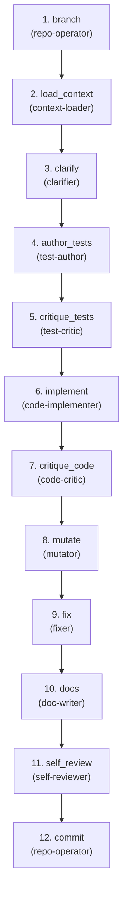

# Build — Design → Code

**Goal:** Implement via adversarial microloops--build code+tests, self-verify, produce receipts that minimize human attention.

**Question:** Does implementation match design?

**Core Outputs:** `src/*`, `tests/*`, `build_receipt.json`

---

## Artifact Paths

For a given run (`run-id`), define:

- `RUN_BASE = swarm/runs/<run-id>`

Non-code artifacts for this flow are written under:

- `RUN_BASE/build/`

Code/tests remain in standard locations: `src/`, `tests/`, `features/`,
`migrations/`, `fuzz/`.

For example:

- `RUN_BASE/build/subtask_context_manifest.json`
- `RUN_BASE/build/clarification_questions.md`
- `RUN_BASE/build/test_changes_summary.md`
- `RUN_BASE/build/test_critique.md`
- `RUN_BASE/build/impl_changes_summary.md`
- `RUN_BASE/build/code_critique.md`
- `RUN_BASE/build/mutation_report.md`
- `RUN_BASE/build/fix_summary.md`
- `RUN_BASE/build/doc_updates.md`
- `RUN_BASE/build/self_review.md`
- `RUN_BASE/build/build_receipt.json`

---

## Upstream Inputs

Flow 3 reads from Flow 1 (`RUN_BASE/signal/`):

- `requirements.md` -- what to implement
- `requirements_critique.md` -- where requirements are weak
- `features/*.feature` -- BDD scenarios to test against

Flow 3 reads from Flow 2 (`RUN_BASE/plan/`):

- `impact_map.json` -- which files/modules to focus on
- `adr.md` -- architectural decisions to follow
- `api_contracts.yaml` -- API shapes to implement
- `schema.md` -- data models
- `observability_spec.md` -- metrics/logs to wire
- `test_plan.md` -- test strategy and priorities
- `work_plan.md` -- subtasks to implement

---

## Orchestration Model

Flow specs describe **what** happens; the orchestrator (top-level Claude)
decides **how** to invoke agents.

### Two Execution Levels

1. **Orchestrator (top-level Claude)**:
   - Can call all agents: built-in (`explore`, `plan-subagent`,
     `general-subagent`) and domain (`.claude/agents/*.md`)
   - Interprets agent outputs (status, recommended_next) to decide routing
   - Controls microloop iteration (test <-> critic, code <-> critic)

2. **All Agents** (test-author, code-implementer, etc.):
   - Inherit full tooling from the main Claude Code session (Read, Write, Glob, Grep, Bash)
   - Can optionally restrict to specific skills via `skills:` frontmatter; behavior is constrained by prompts
   - Currently cannot call other agents (Claude Code limitation, not design)

### Microloop Control

Agents don't know they're in a loop. They:

- Read inputs, write outputs
- Set status (VERIFIED/UNVERIFIED/BLOCKED)
- Optionally suggest `recommended_next`

The **orchestrator** interprets these signals to decide whether to:

- Route back to an implementer (if critic says UNVERIFIED with actionable, new feedback)
- Proceed forward (if VERIFIED, or if UNVERIFIED but no viable path to fix the concerns)

---

## Downstream Contract

Flow 3 is "complete for this run" when these exist (even if imperfect):

- `subtask_context_manifest.json` -- files and specs in focus for this run
- `clarification_questions.md` -- ambiguities found and assumptions made
- `test_changes_summary.md` -- what tests were written/changed
- `test_critique.md` -- verdict on test quality
- `impl_changes_summary.md` -- what code was written/changed
- `code_critique.md` -- verdict on code quality
- `mutation_report.md` -- mutation test results (if run)
- `fix_summary.md` -- what issues were fixed
- `doc_updates.md` -- what docs were updated
- `self_review.md` -- narrative summary of the change
- `build_receipt.json` -- structured state with per-dimension verdicts

Code/test changes in `src/`, `tests/`, etc.

Flows 4-6 treat `build_receipt.json` as the primary evidence for this
change.

---

## Agents (9 domain + cross-cutting)

| Agent | Category | Responsibility |
|-------|----------|----------------|
| context-loader | impl | Load relevant context for subtask -> `subtask_context_manifest.json` |
| test-author | impl | Write/update tests -> `tests/*`, `test_changes_summary.md` |
| test-critic | critic | Harsh review vs BDD/spec -> `test_critique.md`. Never fixes. |
| code-implementer | impl | Write code to pass tests -> `src/*`, `impl_changes_summary.md` |
| code-critic | critic | Harsh review vs ADR/contracts -> `code_critique.md`. Never fixes. |
| mutator | verify | Run mutation tests -> `mutation_report.md` |
| fixer | impl | Apply targeted fixes -> `fix_summary.md` |
| doc-writer | impl | Update docs -> `doc_updates.md` |
| self-reviewer | verify | Final review -> `self_review.md`, `build_receipt.json` |

**Cross-cutting used:** clarifier, repo-operator, gh-reporter

**Git flow:** `repo-operator[branch]` at start, `repo-operator[commit]` at
end.

---

<!-- FLOW AUTOGEN START -->
### Flow structure



### Steps

| # | Step | Agents | Role |
| - | ---- | ------ | ---- |
| 1 | `branch` | `repo-operator` — Git workflows: branch, commit, merge, tag. Safe Bash only. | Ensure clean tree, create feature branch with conventional naming. |
| 2 | `load_context` | `context-loader` — Load relevant code/tests/specs for subtask → subtask_context_manifest.json. | Load relevant context for subtask → subtask_context_manifest.json. |
| 3 | `clarify` | `clarifier` — Detect ambiguities, draft clarification questions. | Detect ambiguities, draft clarification questions → clarification_questions.md. |
| 4 | `author_tests` | `test-author` — Write/update tests → tests/*, test_changes_summary.md. | Write/update tests → tests/*, test_changes_summary.md. |
| 5 | `critique_tests` | `test-critic` — Harsh review vs BDD/spec → test_critique.md. | Harsh review of tests vs BDD/spec → test_critique.md. Never fixes. |
| 6 | `implement` | `code-implementer` — Write code to pass tests, following ADR → src/*, impl_changes_summary.md. | Write code to pass tests, follow ADR → src/*, impl_changes_summary.md. |
| 7 | `critique_code` | `code-critic` — Harsh review vs ADR/contracts → code_critique.md. | Harsh review of code vs ADR/contracts → code_critique.md. Never fixes. |
| 8 | `mutate` | `mutator` — Run mutation tests → mutation_report.md. | Run mutation tests to identify weak spots → mutation_report.md. |
| 9 | `fix` | `fixer` — Apply targeted fixes from critics/mutation → fix_summary.md. | Apply targeted fixes from critics and mutations → fix_summary.md. |
| 10 | `docs` | `doc-writer` — Update inline docs, READMEs, API docs → doc_updates.md. | Update docs, READMEs, API docs → doc_updates.md. |
| 11 | `self_review` | `self-reviewer` — Final review → self_review.md, build_receipt.json. | Final review → self_review.md, build_receipt.json with per-dimension verdicts. |
| 12 | `commit` | `repo-operator` — Git workflows: branch, commit, merge, tag. Safe Bash only. | Stage changes, compose commit message, commit to feature branch. |
<!-- FLOW AUTOGEN END -->

---

## Orchestration Strategy

Flow 3 is the **heavy microloop factory**. It has three adversarial loops,
all controlled at the orchestration level.

### Key Principle: Agents Don't Know They're Looping

Agents just:

- Read their inputs
- Write their outputs
- Set a `status` (VERIFIED/UNVERIFIED/BLOCKED)
- Optionally suggest `recommended_next` agents

The **orchestrator** interprets these signals and decides whether to route
back to an implementer or proceed forward.

### Clarification Step

The orchestrator should:

1. Call `clarifier` after loading context to scan for ambiguities.
2. Document questions and assumptions in `clarification_questions.md`.
3. Continue regardless of questions found (non-blocking).

### Test Microloop

The orchestrator should:

1. Call `test-author` to write/update tests for the current subtask.
2. Call `test-critic` to review them.
3. If `test-critic.status == UNVERIFIED` with `can_further_iteration_help: yes`:
   - Route back to `test-author` to iterate.
4. If `test-critic.status == VERIFIED` or `status == UNVERIFIED` with `can_further_iteration_help: no`:
   - Proceed to `code-implementer`.

### Code Microloop

The orchestrator should:

1. Call `code-implementer` to implement behavior.
2. Call `code-critic` to review code.
3. If `code-critic.status == UNVERIFIED` with `can_further_iteration_help: yes`:
   - Route back to `code-implementer` to iterate.
4. If `code-critic.status == VERIFIED` or `status == UNVERIFIED` with `can_further_iteration_help: no`:
   - Proceed to `mutator`.

### Hardening Loop

The orchestrator should:

1. Call `mutator` to run mutation tests.
2. Call `fixer` to address concrete issues from `mutation_report.md`,
   `test_critique.md`, and `code_critique.md`.
3. If `fixer` makes changes, optionally re-run relevant checks.
4. Proceed to `doc-writer` and `self-reviewer`.

### Per-Subtask Iteration

For each subtask in `work_plan.md`:

- Run the test microloop for that subtask
- Run the code microloop for that subtask
- Run hardening once per subtask or batch

Flow 3 is designed to be run **multiple times** on the same `run-id`. Each
run tightens alignment.

---

## Status States and FR Status Scheme

Agents set status in their output artifacts:

- **VERIFIED** -- Work is adequate for its purpose; here's why.
- **UNVERIFIED** -- Work has issues; here are concrete concerns.
- **BLOCKED** -- Couldn't meaningfully complete; here's what's missing.

Critics (`test-critic`, `code-critic`) use these states. The orchestrator
uses status to decide whether to loop or proceed.

### Functional Requirement (FR) Status Scheme

Each FR from Flow 1 (`requirements.md`) must have an explicit status after
Flow 3 completes:

- **FULLY_VERIFIED**: All tests tagged for this FR pass (no xfail/skip).
  Negative cases asserted. Code implementation found. No exceptions.
- **MVP_VERIFIED**: All MVP-tagged tests pass. Extended/optional tests may
  be xfailed, but MUST be tagged as `@EXT` or `@FUTURE`. Code implements
  MVP scope. Explicitly acceptable limitation.
- **PARTIAL**: Some tests pass, some fail, or some implementation missing.
  This FR cannot be claimed as ready. Blocked or deferred.
- **UNKNOWN**: Insufficient information; coverage unclear. Requires
  investigation by critic.

**Hard Rules for Critics**:

1. No FR may be marked FULLY_VERIFIED if any of its tests are xfailed or
   marked `@SKIP`.
2. If an FR is claimed FULLY_VERIFIED but tests or code cannot be found,
   critic must downgrade to PARTIAL and flag the discrepancy.
3. If an FR has a failing test (FAIL), it is PARTIAL by definition.
4. If a critic cannot find both test coverage AND implementation for an FR,
   it must flag the gap explicitly: either direct test-author/code-implementer
   to fill it, or mark the FR PARTIAL.

### Build Receipt Structure

`build_receipt.json` must have structured fields that critics and reporters
can only *consume*, not upgrade:

```json
{
  "run_id": "<run-id>",
  "branch": "<branch-name>",
  "timestamp": "<iso8601>",
  "requirements": {
    "touched": ["REQ-001", "REQ-004"],
    "untouched": ["REQ-007"],
    "fr_status": {
      "REQ-001": "FULLY_VERIFIED",
      "REQ-004": "MVP_VERIFIED",
      "REQ-007": "PARTIAL"
    }
  },
  "tests": {
    "status": "VERIFIED | UNVERIFIED | BLOCKED",
    "total": "<PYTEST_TOTAL>",
    "passed": "<PYTEST_PASSED>",
    "failed": "<PYTEST_FAILED>",
    "xfailed": "<PYTEST_XFAILED>",
    "xpassed": "<PYTEST_XPASSED>",
    "skipped": "<PYTEST_SKIPPED>",
    "pytest_summary_source": "test_summary.md (canonical)",
    "summary_file": "test_changes_summary.md",
    "metrics_consistency": "OK | MISMATCH"
  },
  "code": {
    "status": "VERIFIED | UNVERIFIED | BLOCKED",
    "summary_file": "impl_changes_summary.md"
  },
  "mutation": {
    "status": "VERIFIED | NOT_RUN | BLOCKED",
    "score": "<MUTATION_SCORE>",
    "killed": "<MUTATIONS_KILLED>",
    "total": "<MUTATIONS_TOTAL>"
  },
  "docs": {
    "updated": true
  },
  "metrics_binding": "pytest | hard_coded",
  "notes": [
    "REQ-004 is MVP_VERIFIED; extended tests xfailed as @EXT",
    "Mutation score <MUTATION_SCORE> with <MUTATIONS_KILLED>/<MUTATIONS_TOTAL> killed"
  ]
}
```

**Template Note**: The values shown in angle brackets (`<PYTEST_TOTAL>`, `<MUTATIONS_SCORE>`, etc.) are **placeholders only**. Always extract metrics directly from pytest output or mutation tool; never use template numbers as actual values.

**Invariants**:

- Numeric metrics (`total`, `passed`, `killed`, etc.) MUST come from pytest
  or mutation tool canonical output, never inferred or recalculated.
- If a metric is hard-coded or inferred, `metrics_binding: hard_coded` and
  receipt status must be UNVERIFIED.
- Critics must bind reported test counts to actual pytest output; any
  mismatch triggers UNVERIFIED/BLOCKED status.
- Reporters may only *read* `fr_status` from critics; they may not change it.
- Self-reviewer may only *consume and reflect* critic verdicts; it must not
  override or upgrade them.

Gate reads this receipt; don't make Gate re-derive Build state from dozens
of files.

---

## Critic Hard Rules (Ground Truth Binding)

Critics and reporters must treat certain outputs as **canonical** and never
override or infer them. These are the "ground truth sources" for Flow 3.

### test-critic Hard Rules

1. **Bind to pytest output**: test-critic MUST read and quote the actual
   pytest summary (counts, status). Any narrative in test critique or
   self-review that contradicts pytest counts triggers UNVERIFIED/BLOCKED.

2. **FR-to-test mapping**: test-critic MUST identify which tests map to
   which FRs (via naming convention, markers, or manual review). If an FR
   claims "FULLY_VERIFIED" but test-critic cannot find covering tests,
   downgrade to PARTIAL.

3. **xfail detection**: If any test for an FR is xfailed and FR is claimed
   FULLY_VERIFIED, set Status: UNVERIFIED. Only MVP_VERIFIED may have xfailed
   tests (if tagged @EXT).

4. **Metrics consistency**: If prose says "196 tests total" but pytest says
   "191 passed + 4 xfailed + 1 xpassed = 196 total", document the exact
   breakdown. If inconsistency found (e.g., 196 vs 224), set Status: BLOCKED
   with "metrics mismatch" and require self-reviewer to fix upstream.

### code-critic Hard Rules

1. **FR coverage check**: code-critic MUST attempt to locate, for each FR:
   - Where is it implemented? (file:line range)
   - Where is it tested? (test name/file)

2. **Gap detection**: If an FR is claimed FULLY_VERIFIED but code-critic
   cannot find implementation AND test coverage, flag this explicitly:
   set Status: UNVERIFIED with a note like "FR-002 claimed verified but
   no implementation or tests found; cannot confirm."

3. **xfailed core behavior**: If any test for a core FR behavior (non-optional)
   is xfailed, code-critic must note this in critique. If FR status is
   FULLY_VERIFIED, downgrade to PARTIAL or MVP_VERIFIED.

### mutator Hard Rules

1. **Mutation score binding**: mutator MUST report the actual mutation score
   from the tool (killed / total). Do not invent thresholds.

2. **Surviving critical mutations**: If a surviving mutation is in a code path
   corresponding to an FR test, mutator must flag it: either fixer can add
   tests, or that FR drops to PARTIAL.

3. **No threshold rounding**: If mutation score is 71%, report 71%. Do not
   round to "acceptable" or "weak"—report what you observe. Fixer/critic
   interpret scores in context of FR claims.

### self-reviewer Hard Rules

1. **Never recalculate metrics**: All numeric values (test counts, mutation
   scores) MUST come verbatim from pytest, mutation reports, etc. Do not
   infer or average. Set `metrics_binding: hard_coded` if you cannot find
   a ground truth source.

2. **Consume but never upgrade FR status**: If test-critic says "REQ-004 is
   MVP_VERIFIED", self-reviewer reports that. If test-critic says "REQ-007
   PARTIAL", self-reviewer reflects that. Self-reviewer does NOT say "well,
   REQ-007 is probably FULLY_VERIFIED because..."

3. **Detect metric mismatches**: If self-reviewer reads prose that says
   "196 tests" but earlier critiques show pytest reported 224, flag as
   UNVERIFIED: "metrics inconsistent—received claims do not align with pytest
   summary."

4. **Include pytest summary verbatim**: self-reviewer MUST include the actual
   pytest summary line (e.g., "191 passed, 4 xfailed, 1 xpassed, 0 failed")
   in its review output.

### gh-reporter Hard Rules

1. **No metric recomputation**: Reporters do not calculate or infer metrics.
   Report what the receipt and critiques say, period.

2. **No status upgrades**: If receipt says "PARTIAL", report "PARTIAL", even
   if it looks incomplete. Do not say "but this is almost done."

3. **Labels matter**: If an FR is MVP_VERIFIED vs FULLY_VERIFIED, preserve
   that distinction in the GitHub summary. Ambiguity serves no one.

---

## Microloop Contract

For any implementer/critic pair (test-author/test-critic,
code-implementer/code-critic):

### Implementer Succeeds If

1. They attempted concrete improvements based on the latest critique.
2. They wrote or updated the agreed artifacts.
3. They left context for the next agent: what changed, what's still weak,
   what questions remain.

### Critic Succeeds If

1. They read relevant inputs (specs, context, previous receipts).
2. They evaluated the artifact honestly.
3. They produced a critique with one of these outcomes:
   - **VERIFIED** -- adequate for its purpose, here's why
   - **UNVERIFIED** -- not adequate, here are concrete concerns
   - **BLOCKED** -- couldn't meaningfully review, here's what's missing

### Loop Termination

The orchestrator moves forward when:

- Critic says VERIFIED, or
- Critic says UNVERIFIED but sets `can_further_iteration_help: no` (judge has determined no viable fix path exists within scope/constraints)

The orchestrator does **not** enforce iteration caps. Context limits and runtime naturally stop loops. The critic's explicit judgment about iteration viability drives termination, not heuristics like "material newness" of feedback.

---

## Rerun Semantics

Flow 3 is designed to be run **multiple times** per change:

- 2-4 runs on a big feature is normal
- Each run tightens alignment with specs
- Each run produces updated receipts

Flow 3 can be re-run on the same `run-id`:

- When Flow 4 bounces back with `BOUNCE -> build`
- When humans provide additional guidance
- When CI results reveal issues

Agents are brownfield-aware:

- `test-author` reads existing tests and extends them
- `code-implementer` reads existing code and evolves it
- `self-reviewer` reads previous receipts and updates them

Re-running Flow 3 is "tighten the implementation", not "start over."

---

## Notes

- Human gate at end: "Does this implementation work?"
- Critics stay adversarial; trust accrues in receipts, not claims.
- `repo-operator` uses safe git commands only (no `--force`, no `--hard`).
- Agents iterate until ready or document remaining issues and proceed.
- Multi-path completion: VERIFIED/UNVERIFIED/BLOCKED are all "success" if
  the agent did its job honestly.
- Flow 3 is the **workhorse**; expect to run it multiple times per feature.

---

## Out-of-the-Box Implementation

This flow uses **only local files and git**:

- Read from `RUN_BASE/plan/`, write to `RUN_BASE/build/`
- Write code/tests to `src/`, `tests/`, `features/`
- Use `test-runner` and `auto-linter` skills (local cargo/npm commands)
- No external services required

Works immediately on clone.

