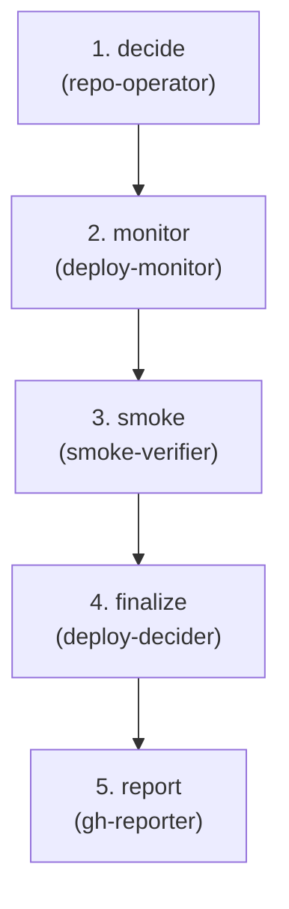

# Deploy — Artifact → Prod

**Goal:** Move an approved artifact from "ready to merge" to "deployed"—execute deployment, verify health, create audit trail.

**Question:** Has the approved change been deployed and is it healthy?

**Core Outputs:** `deployment_decision.md`

---

## Artifact Paths

For a given run (`run-id`), define:

- `RUN_BASE = swarm/runs/<run-id>`

All artifacts for this flow are written under:

- `RUN_BASE/deploy/`

For example:

- `RUN_BASE/deploy/deployment_log.md`
- `RUN_BASE/deploy/verification_report.md`
- `RUN_BASE/deploy/deployment_decision.md`

---

## Upstream Inputs

Flow 5 reads from Flow 4 (`RUN_BASE/gate/`):

- `merge_decision.md` — Gate's decision (MERGE/BOUNCE/ESCALATE)

Flow 5 also reads:

- `build_receipt.json` — for context about what was built
- `observability_spec.md` — for health check expectations (if available)

Git state:

- PR branch and target branch (usually `main`)
- Any tags or release requirements

**Flow 5 is always callable.** Its behavior depends on Gate's decision—see Orchestration Strategy.

---

## Orchestration Model

Flow specs describe **what** happens; the orchestrator (top-level Claude)
decides **how** to invoke agents.

### Two Execution Levels

1. **Orchestrator (top-level Claude)**:
   - Can call all agents: built-in (`explore`, `plan-subagent`,
     `general-subagent`) and domain (`.claude/agents/*.md`)
   - Interprets agent outputs to decide deployment progression
   - May use `explore` to check CI status before invoking verifiers

2. **All Agents** (deploy-monitor, smoke-verifier, etc.):
   - Use tools declared in their frontmatter (Read, Write, Glob, Grep, Bash)
   - Currently cannot call other agents (Claude Code limitation, not design)
   - Interact with GitHub via `gh` CLI tool

### Deployment Decision Flow

The orchestrator reads `merge_decision.md` first:

**If `merge_decision.decision == MERGE`:**
1. Invokes `repo-operator` to merge PR, create tag/release
2. Invokes `deploy-monitor` to watch CI/deployment events
3. Invokes `smoke-verifier` for health checks
4. Invokes `deploy-decider` to synthesize results (STABLE/INVESTIGATE/ROLLBACK)

**If `merge_decision.decision != MERGE` (BOUNCE or ESCALATE):**
1. `repo-operator` does **not** merge
2. `deployment_log.md` records: "No merge performed; Gate decision = BOUNCE/ESCALATE"
3. `verification_report.md` may be empty or minimal
4. `deploy-decider` writes `deployment_decision.md` with status explaining why deployment did not occur

Flow 5 always completes and writes receipts—even if the only thing it can honestly say is "we didn't deploy because Gate said no."

---

## Downstream Contract

Flow 5 is "complete for this run" when these exist:

- `deployment_log.md` — record of merge, tag, release actions (optional)
- `verification_report.md` — CI status + smoke check results
- `deployment_decision.md` — STABLE/INVESTIGATE/ROLLBACK verdict

Flow 6 uses `deployment_decision.md` as its entry point.

---

## Agents (3 domain + cross-cutting)

| Agent | Category | Responsibility |
|-------|----------|----------------|
| deploy-monitor | deploy | Watch CI/deployment events → `verification_report.md` |
| smoke-verifier | verify | Health checks, artifact verification → appends to `verification_report.md` |
| deploy-decider | verify | Synthesize verification → `deployment_decision.md` |

**Cross-cutting used:** repo-operator, gh-reporter

**Git flow:** `repo-operator[merge+tag]` at start.

---

<!-- FLOW AUTOGEN START -->
### Flow structure



### Steps

| # | Step | Agents | Role |
| - | ---- | ------ | ---- |
| 1 | `decide` | `repo-operator` — Git workflows: branch, commit, merge, tag. Safe Bash only. | Merge PR to target branch, create git tag and GitHub release. Record actions in deployment_log.md. |
| 2 | `monitor` | `deploy-monitor` — Watch CI and deployment events | Watch CI/deployment events for the merge commit. Record CI status and deployment events in verification_report.md. |
| 3 | `smoke` | `smoke-verifier` — Run health checks and verify artifacts | Run health checks if endpoints available. Verify artifact/release existence. Append results to verification_report.md. |
| 4 | `finalize` | `deploy-decider` — Verify operationalization FRs (FR-OP-001..005) and issue deployment decision | Synthesize CI + smoke results into deployment_decision.md with status: STABLE/INVESTIGATE/ROLLBACK/NOT_DEPLOYED. |
| 5 | `report` | `gh-reporter` — Post summaries to GitHub issues/PRs at flow boundaries. | Post deployment summary to PR/issue to close the feedback loop. |
<!-- FLOW AUTOGEN END -->

---

## Orchestration Strategy

Flow 5 is a **linear pipeline** with no internal loops.

### Execution Order

1. **repo-operator** (merge+tag mode):
   - Merge PR to target branch
   - Create git tag and GitHub release (if configured)
   - Record actions in `deployment_log.md`

2. **deploy-monitor**:
   - Watch CI/deployment events for the merge commit
   - Record CI status, deployment events in `verification_report.md`

3. **smoke-verifier**:
   - Run health checks if endpoints available
   - Verify artifact/release existence
   - Append results to `verification_report.md`

4. **deploy-decider**:
   - Synthesize CI + smoke results into `deployment_decision.md`

5. **gh-reporter**:
   - Post deployment summary to PR/issue

### No Internal Loops

If deployment fails or is flaky, re-run Flow 5 from the top after fixing infrastructure issues. Don't try to loop internally.

---

## Deployment Readiness: Operationalization FRs

Flow 5 is not about shipping a user-facing app. **It is about operationalizing the governance layer built in Flows 1–4.**

This repo's Flow 5 spec includes five operationalization functional requirements (FR-OP-001..005) that validate the validator + gate are actually enforced in the SDLC:

### Operationalization FRs (from `swarm/runs/swarm-alignment/signal/requirements.md`)

- **FR-OP-001 (MUST):** CI validator job runs on every push/PR and is a required status check
- **FR-OP-002 (MUST):** CI test job runs on every push/PR and is a required status check
- **FR-OP-003 (MUST):** `.pre-commit-config.yaml` wires the validator hook; `CONTRIBUTING.md` documents setup
- **FR-OP-004 (MUST):** Branch protection on `main` requires both validator and test jobs
- **FR-OP-005 (SHOULD):** `RUNBOOK.md` documents the enforcement (soft; does not block STABLE)

### Deployment Readiness Check

Before issuing a deployment decision, `deploy-decider` must verify these FRs:

#### Verifying FR-OP-001 & FR-OP-002 (CI Jobs)

**Strategy:**
- Read `.github/workflows/ci.yml` (or `ci.yaml`, or common CI config files)
- Check for jobs that run:
  - Validator: `uv run swarm/tools/validate_swarm.py`
  - Tests: `uv run pytest` or equivalent

**Status signals:**
- **PASS:** Both jobs present and runnable
- **FAIL:** One or both jobs missing from CI config
- **INVESTIGATE:** Jobs present but not marked as required in GitHub (see FR-OP-004)

#### Verifying FR-OP-003 (Pre-Commit Hook)

**Strategy:**
- Read `.pre-commit-config.yaml` (must exist)
- Check for a hook with `id: swarm-validate` (or similar) that runs the validator
- Read `CONTRIBUTING.md` (or equivalent)
- Check for a section mentioning `pre-commit install` or local validation setup

**Status signals:**
- **PASS:** Both config and docs present and linked
- **FAIL:** Either config missing or docs missing
- **UNKNOWN:** Config exists but docs not found (rare; treat as FAIL)

#### Verifying FR-OP-004 (Branch Protection)

**Strategy - Attempt A (if GitHub API available):**
- Use `gh api repos/<owner>/<repo>/branches/main/protection` to query branch rules
- Check if `required_status_checks.checks` includes jobs from FR-OP-001/002

**If GitHub API succeeds:**
- **PASS:** Both validator and test jobs listed as required
- **FAIL:** One or both missing from required checks

**Strategy - Attempt B (if API unavailable or fails):**
- Require manual snapshot: `RUN_BASE/deploy/branch_protection.md`
- This file should assert which checks are required on `main`

**If manual snapshot provided:**
- **PASS:** Snapshot explicitly states validator + tests are required
- **FAIL:** Snapshot doesn't assert required checks, or file is missing

**If neither succeeds:**
- **UNKNOWN:** Cannot verify branch protection (neither API nor manual snapshot available)
- **Effect on deployment status:** UNKNOWN on FR-OP-004 → `status: NOT_DEPLOYED`

#### Verifying FR-OP-005 (RUNBOOK)

**Strategy:**
- Read `RUNBOOK.md` (or `README.md` if project uses that)
- Check for a section on "Enforcement" or "Spec/Implementation Alignment"
- Section should be non-empty and explain the validator + CI/pre-commit

**Status signals:**
- **PASS:** Clear enforcement section present
- **FAIL:** Section missing or placeholder

**Special note:** FAIL on FR-OP-005 alone does not block `status: STABLE` (it's a SHOULD_HAVE). But it must be added to `recommended_actions`.

### Handling Unknown Status (when GitHub API unavailable)

If `gh api` access is not available:

**For FR-OP-001/002:**
- Agent **may** infer job presence from `.github/workflows/ci.yml` (read file)
- If file absent or job names not found → mark **FAIL** (not UNKNOWN)
- If jobs exist but cannot verify via GitHub API that they are required → mark **UNKNOWN** with evidence

**For FR-OP-004 (Branch Protection):**
- Agent **must** require a manual snapshot file: `RUN_BASE/deploy/branch_protection.md`
- If this file is not provided and GitHub API is unavailable → mark **UNKNOWN** and set `deployment_decision: NOT_DEPLOYED`
- If provided, read the snapshot and verify it asserts the required checks. If not → mark **FAIL**

**Rule for UNKNOWN:**
- If any of FR-OP-001/002/004 is marked **UNKNOWN**, the deployment decision **must be** `status: NOT_DEPLOYED` with explicit evidence of what couldn't be verified
- Do not default to STABLE when you have UNKNOWN—missing verification is not the same as passing verification

### Completion States

`deploy-decider` outputs one of:

- **STABLE:** Gate `verdict: MERGE` **AND** FR-OP-001, FR-OP-002, FR-OP-003, FR-OP-004 all **PASS**
  - FR-OP-005 may be PASS or FAIL
  - If FR-OP-005 is FAIL, record in `recommended_actions`

- **NOT_DEPLOYED:** Gate `verdict: MERGE` **BUT** any of FR-OP-001, FR-OP-002, FR-OP-003, FR-OP-004 is **FAIL** or **UNKNOWN**
  - Include explicit `failed_frs` and `recommended_actions`
  - Set `bounce_target` per rules below

- **BLOCKED:** Gate `verdict: BOUNCE`, `ESCALATE`, or missing artifact
  - Do not attempt operationalization verification
  - Document Gate's decision and halt

- **INVESTIGATE:** An unexpected error occurred during deployment checks (corrupted artifact, unreadable file, etc.)
  - Include error details in `rationale`
  - Do not emit `bounce_target` until human clarifies

### Bounce Target Defaults (for this repo)

If `status: NOT_DEPLOYED`, deploy-decider **must** set `bounce_target` using these rules:

1. **If FR-OP-001, FR-OP-002, or FR-OP-003 fail:**
   - `bounce_target: same-run` (this run-id, "operationalization" subtask)
   - Rationale: These gaps are repo-owned. A contributor can create a PR that fixes them (add CI job, wire pre-commit, etc.), and Flow 5 can be re-run

2. **If FR-OP-004 fails because branch protection cannot be set from this repo:**
   - `bounce_target: swarm-org-ops` (or a new run specifically for org-level changes)
   - Rationale: The gap is outside the repo. A separate ticket should be created to grant the repo org-level branch rule permissions or to apply rules via org policy

3. **If FR-OP-005 (RUNBOOK) fails alone:**
   - Do not set `bounce_target`
   - Instead, add to `recommended_actions`: "Add 'Enforcement' section to RUNBOOK.md (low priority; does not block deployment)"

---

## Status States

`deploy-decider` outputs one of:

- **STABLE** — All verification passes; deployment healthy.
- **INVESTIGATE** — Warnings or anomalies; needs attention but not
  immediately critical.
- **ROLLBACK** — Critical issues; should revert.
- **NOT_DEPLOYED** — Gate did not approve merge; no deployment attempted.

### Deployment Decision Structure

`deployment_decision.md` should have structured content like:

```yaml
status: STABLE | INVESTIGATE | ROLLBACK | NOT_DEPLOYED

signals:
  ci: PASS | FAIL | FLAKY | N/A
  smoke: PASS | FAIL | UNKNOWN | N/A
  gate_decision: MERGE | BOUNCE | ESCALATE

merge:
  performed: true | false
  commit: "<sha>"  # if merged
  branch: "main"
  tag: "v1.2.3"  # if tagged

summary:
  - "CI: all required checks passed."
  - "Smoke: health endpoint responded 200 OK."

recommended_actions:
  - "Monitor error rate on dashboard X for 30 minutes."

concerns:  # if INVESTIGATE, ROLLBACK, or NOT_DEPLOYED
  - "CI job 'e2e-tests' flaky; passed on retry."
  - "Gate decision was BOUNCE; merge not performed."
```

---

## Verification Report Structure

`verification_report.md` combines outputs from `deploy-monitor` and `smoke-verifier`:

```markdown
# Verification Report

## Commit
- sha: 1234abcd
- branch: main
- tag: v1.2.3

## CI Status
- build: PASS
- test: PASS
- deploy-staging: PASS
- deploy-prod: PASS

## Smoke Checks
- api.example.com/_health → 200 OK
- Version header: v1.2.3

## Issues
- None observed at verification level.
```

---

## Rerun Semantics

Flow 5 can be re-run on the same `run-id`:

- If CI was flaky and you want to re-verify
- If smoke checks failed due to transient issues
- After infrastructure fixes
- After Gate re-runs and changes its decision

Rerunning Flow 5 after merge is essentially "re-verify the rollout."

Flow 5 is **always callable**—it reads Gate's decision and behaves accordingly. If Gate said BOUNCE or ESCALATE, Flow 5 runs but doesn't merge, and writes receipts explaining why.

---

## Notes

- Flow 5 is always callable; behavior depends on Gate's decision.
- If Gate said MERGE: merge, verify, report.
- If Gate said BOUNCE/ESCALATE: don't merge, write receipt explaining why.
- Human gate at end: "Did deployment succeed?" (or "Why didn't we deploy?")
- Minimal agents—deployment is verification, not creation.
- Uses GitHub-native tooling (`gh` CLI, GitHub Actions).
- Agents never block; if verification fails, document concern and continue.
- Multi-path completion: STABLE/INVESTIGATE/ROLLBACK/NOT_DEPLOYED are all
  valid outcomes.

---

## Out-of-the-Box Implementation

The GitHub-native implementation uses **only git and GitHub** (via `gh` CLI):

- Merge PR to main branch
- Create git tag and GitHub release
- Monitor GitHub Actions/CI status
- Verify via CI checks + basic health endpoints (if available)
- Post deployment summary to PR/issue

No external deployment platform required. Works immediately on clone.

---

## Production Extension Points

See `swarm/infrastructure/flow-5-extensions.md` for how to wire:

- Real deployment platforms (Kubernetes, ECS, Cloud Run)
- Canary analysis with metrics
- Automated rollback mechanisms
- Blue/green or progressive delivery

Extensions add environment variable detection; baseline always works.

