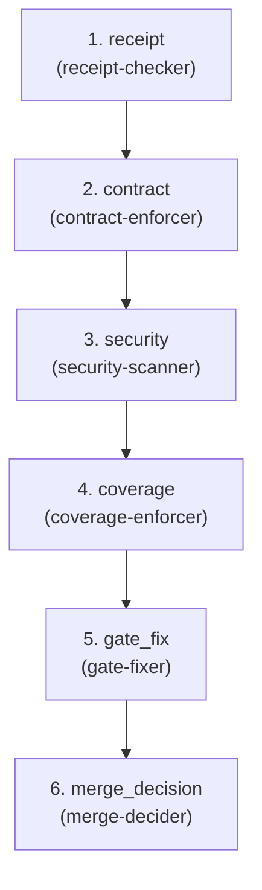

# Gate — Code → Artifact

**Goal:** Audit receipts, verify contracts, enforce policies—second-layer gravity that protects maintainer attention.

**Question:** Is this merge-eligible?

**Core Outputs:** `merge_decision.md`

---

## Artifact Paths

For a given run (`run-id`), define:

- `RUN_BASE = swarm/runs/<run-id>`

All artifacts for this flow are written under:

- `RUN_BASE/gate/`

For example:

- `RUN_BASE/gate/receipt_audit.md`
- `RUN_BASE/gate/contract_compliance.md`
- `RUN_BASE/gate/security_scan.md`
- `RUN_BASE/gate/coverage_audit.md`
- `RUN_BASE/gate/gate_fix_summary.md`
- `RUN_BASE/gate/merge_decision.md`

---

## Upstream Inputs

Flow 4 reads primarily from Flow 3 (`RUN_BASE/build/`):

- `build_receipt.json` — structured summary of Build state
- `self_review.md` — narrative summary
- `test_changes_summary.md`, `test_critique.md` — test state
- `impl_changes_summary.md`, `code_critique.md` — code state
- `mutation_report.md`, `fix_summary.md` — hardening state
- Test output logs (if present)

Flow 4 also reads from Flows 1-2:

- `requirements.md`, `requirements_critique.md` — what was required
- `features/*.feature` — BDD scenarios
- `adr.md` — architectural decisions
- `api_contracts.yaml` — contract definitions
- `schema.md` — data models
- `test_plan.md` — expected test coverage
- `design_validation.md` — design assessment
- `observability_spec.md` — expected observability

---

## Orchestration Model

Flow specs describe **what** happens; the orchestrator (top-level Claude)
decides **how** to invoke agents.

### Two Execution Levels

1. **Orchestrator (top-level Claude)**:
   - Can call all agents: built-in (`explore`, `plan-subagent`,
     `general-subagent`) and domain (`.claude/agents/*.md`)
   - Interprets agent outputs to decide merge/bounce/escalate
   - May use `explore` to verify artifacts exist before invoking checkers

2. **All Agents** (receipt-checker, contract-enforcer, etc.):
   - Use tools declared in their frontmatter (Read, Write, Glob, Grep, Bash)
   - Currently cannot call other agents (Claude Code limitation, not design)
   - Use Skills (auto-linter, policy-runner) when declared in frontmatter

### Gate Decision Flow

The orchestrator:

1. Invokes verification agents in parallel where possible
2. Collects their verdicts
3. Invokes `merge-decider` with aggregated results
4. Routes based on decision: MERGE → done, BOUNCE → back to Build/Plan

---

## Downstream Contract

Flow 4 is "complete for this run" when these exist:

- `receipt_audit.md` — verification of Build receipts
- `contract_compliance.md` — API/schema compatibility assessment
- `security_scan.md` — security scan results
- `coverage_audit.md` — test coverage assessment
- `gate_fix_summary.md` — mechanical fixes applied (if any)
- `merge_decision.md` — final verdict with rationale

Flow 5 only proceeds if `merge_decision.decision == MERGE`.

---

## Agents (6 domain + cross-cutting)

| Agent | Category | Responsibility |
|-------|----------|----------------|
| receipt-checker | verify | Verify `build_receipt.json` exists and is complete → `receipt_audit.md` |
| contract-enforcer | verify | Check API changes vs contracts → `contract_compliance.md` |
| security-scanner | verify | Run SAST, secret scans → `security_scan.md` |
| coverage-enforcer | verify | Verify coverage meets expectations → `coverage_audit.md` |
| gate-fixer | impl | Mechanical fixes only → `gate_fix_summary.md` |
| merge-decider | verify | Synthesize all checks → `merge_decision.md` |

**Cross-cutting used:** risk-analyst, policy-analyst, gh-reporter

---

<!-- FLOW AUTOGEN START -->
### Flow structure



### Steps

| # | Step | Agents | Role |
| - | ---- | ------ | ---- |
| 1 | `receipt` | `receipt-checker` — Verify build receipt exists and is complete | Verify build_receipt.json completeness → receipt_audit.md. |
| 2 | `contract` | `contract-enforcer` — Check API changes versus contracts | Check API changes versus contracts → contract_audit.md. |
| 3 | `security` | `security-scanner` — Run SAST and secret scans | Run SAST and secret scans → security_audit.md. |
| 4 | `coverage` | `coverage-enforcer` — Verify test coverage meets thresholds | Verify test coverage meets thresholds → coverage_audit.md. |
| 5 | `gate_fix` | `gate-fixer` — Mechanical fixes only (lint/format/docs) → gate_fix_summary.md. | Apply mechanical fixes only → gate_fix_summary.md. |
| 6 | `merge_decision` | `merge-decider` — Synthesize all checks into merge decision | Synthesize all checks into merge decision → merge_decision.md. |
<!-- FLOW AUTOGEN END -->

---

## Orchestration Strategy

Gate is a **verifier, not a builder**. It does single-pass verification with optional local fixes.

### Fan-Out Verification

After `receipt-checker` audits the Build receipts, these can run in
parallel:

- `contract-enforcer`
- `security-scanner`
- `coverage-enforcer`

They all depend on `receipt_audit.md` but not on each other.

### Local Fix Loop (Mechanical Only)

The orchestrator may:

1. Call `gate-fixer` after verification agents complete.
2. If `gate-fixer` makes mechanical changes, optionally re-run relevant
   checks.
3. `gate-fixer` may run once or twice for additional mechanical issues
   discovered.

This is **not** a deep microloop like Flow 3. If issues require more than
mechanical fixes, they trigger a BOUNCE.

### Key Principle: Agents Don't Know They're Looping

Same as Flow 3: agents just read inputs, write outputs, set status, and
suggest next agents. The orchestrator decides routing.

---

## Gate Fixer Scope (Mechanical Only)

**Can fix:**

- Lint/format via `auto-linter` skill
- Missing docstrings in new code
- Typos in comments/docs
- Changelog updates
- Import organization

**Cannot fix (BOUNCE to Build):**

- Logic changes
- Test behavior or structure
- API contract changes
- Schema migrations
- Error handling

**Cannot fix (BOUNCE to Plan):**

- Design flaws
- Architecture issues
- Missing requirements

`gate-fixer` leaves a clear trail in `gate_fix_summary.md` of what it
fixed and what it explicitly did not attempt.

---

## Functional Requirement (FR) Readiness Criteria

Flow 4 must enforce FR status from `build_receipt.json` before allowing merge. The receipt includes an `fr_status` dictionary mapping requirement IDs to verification states:

- `FULLY_VERIFIED` — Requirement fully implemented and tested
- `MVP_VERIFIED` — Core requirement met; optional aspects deferred
- `PARTIAL` — Requirement partially implemented; gaps exist
- `UNKNOWN` — Requirement status cannot be determined

### Merge Readiness Rules

**MUST-HAVE Requirements** (from Flow 1 signal/requirements.md):

- **All MUST-HAVE FRs must be `FULLY_VERIFIED` or `MVP_VERIFIED`** (with explicit deferral documented)
- If any MUST-HAVE FR is `PARTIAL` or `UNKNOWN` → **BOUNCE to Build** with list of incomplete FRs
- Exception: Explicit deferral with human approval may allow `MVP_VERIFIED` with tracked follow-up issue

**SHOULD-HAVE Requirements**:

- `FULLY_VERIFIED` or `MVP_VERIFIED` → acceptable for merge
- `PARTIAL` → acceptable if risk accepted and documented in merge decision
- `UNKNOWN` → acceptable if receipt-checker confirmed it's due to measurement gap, not implementation gap

### Merge Decision Integration

`merge-decider` must:

1. Read `build_receipt.json` and extract the `fr_status` dictionary
2. Classify each FR as MUST-HAVE or SHOULD-HAVE (from Flow 1 requirements)
3. Check readiness:
   - **If any MUST-HAVE is `PARTIAL` or `UNKNOWN`:** Set `decision: BOUNCE`, target: `build`, reason: "FR readiness not met"
   - **If all MUST-HAVE are `FULLY_VERIFIED` or `MVP_VERIFIED`:** Proceed to other checks
4. If BOUNCE decision is reached due to FR status, list specific failing FRs in bounce_reasons

If `fr_status` field is missing or malformed, `receipt-checker` sets status `BLOCKED` and `merge-decider` cannot proceed.

---

## Status States

Agents set status in their output artifacts:

- **VERIFIED** — Check passed; here's why.
- **UNVERIFIED** — Check has concerns; here are the issues.
- **BLOCKED** — Couldn't run check; here's what's missing.

`merge-decider` synthesizes all statuses into a merge decision.

---

## Merge Decision States

`merge-decider` outputs one of:

- **MERGE** — All checks pass or concerns are acceptable; ready to deploy.
- **BOUNCE** — Issues found; specifies target flow (Build or Plan) and
  reasons.
- **ESCALATE** — Needs human judgment; explains why automated decision
  isn't sufficient.

### Merge Decision Structure

`merge_decision.md` should have structured content like:

```yaml
decision: MERGE | BOUNCE | ESCALATE

bounce_target:
  - build    # Flow 3
  - plan     # Flow 2
  # empty if MERGE

checks:
  receipts: VERIFIED | UNVERIFIED | BLOCKED
  contracts: VERIFIED | UNVERIFIED | BLOCKED
  security: VERIFIED | UNVERIFIED | BLOCKED
  coverage: VERIFIED | UNVERIFIED | BLOCKED

summary:
  - "Contracts match api_contracts.yaml; only additive changes."
  - "Security scan found no HIGH severity issues."
  - "Coverage good for changed modules."

concerns:
  - "Design critic flagged complexity; monitor post-deploy."

bounce_reasons:  # if BOUNCE
  - "security.status == UNVERIFIED: HIGH severity finding in auth module"
  - "coverage.status == UNVERIFIED: core paths uncovered"
```

---

## Rerun Semantics

Flow 4 can be re-run on the same `run-id`:

- After Flow 3 addresses bounced issues
- When CI provides new signals
- When humans want another Gate pass

Agents tolerate existing artifacts:

- `receipt-checker` reads previous audits and updates them
- `merge-decider` considers previous decision context

Re-running Flow 4 is "re-verify with current state", not "start over."

### Bounce vs Rerun

- **Bounce** means `merge-decider` explicitly says "go back to Flow X"
- **Rerun** means running `/flow-4-gate` again after addressing issues
- Both are normal; bounce is explicit feedback, rerun is "check again"

---

## Notes

- Human gate at end: "Should we merge this?"
- Gate is a topology reviewer: validate the shape of the gravity well, not
  vibes.
- Agents never block; if verification incomplete, document concerns and
  continue.
- Multi-path completion: VERIFIED/UNVERIFIED/BLOCKED are all valid outcomes
  if honest.
- BOUNCE and ESCALATE are "successful" Gate outcomes—the flow did its job.
- Gate does NOT become Build 2.0; substantive fixes go back to Flow 3.

---

## Out-of-the-Box Implementation

This flow uses **only local files and git**:

- Read from `RUN_BASE/build/build_receipt.json`, write to `RUN_BASE/gate/`
- Use `auto-linter` and `policy-runner` skills
- No external services required

Works immediately on clone.
