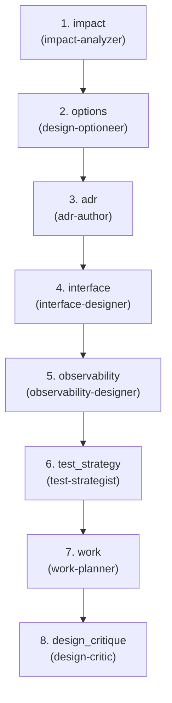

# Plan — Spec → Design

**Goal:** Transform requirements into architecture decisions, contracts, and
implementation plans—build the gravity well that constrains Build and Gate.

**Question:** What architecture solves it?

**Core Outputs:** `adr.md`, `api_contracts.yaml`, `observability_spec.md`,
`test_plan.md`, `work_plan.md`

---

## Artifact Paths

For a given run (`run-id`), define:

- `RUN_BASE = swarm/runs/<run-id>`

All artifacts for this flow are written under:

- `RUN_BASE/plan/`

For example:

- `RUN_BASE/plan/impact_map.json`
- `RUN_BASE/plan/design_options.md`
- `RUN_BASE/plan/adr.md`
- `RUN_BASE/plan/api_contracts.yaml`
- `RUN_BASE/plan/schema.md`
- `RUN_BASE/plan/migrations/*.sql`
- `RUN_BASE/plan/observability_spec.md`
- `RUN_BASE/plan/test_plan.md`
- `RUN_BASE/plan/work_plan.md`
- `RUN_BASE/plan/design_validation.md`

---

## Upstream Inputs

Flow 2 reads from Flow 1 (`RUN_BASE/signal/`):

- `problem_statement.md` — what we're solving
- `requirements.md` — functional + non-functional requirements
- `requirements_critique.md` — quality assessment
- `features/*.feature` — BDD scenarios
- `example_matrix.md` — edge cases
- `stakeholders.md` — who cares
- `early_risks.md` — initial risk assessment
- `scope_estimate.md` — size estimate

---

## Orchestration Model

Flow specs describe **what** happens; the orchestrator (top-level Claude)
decides **how** to invoke agents.

### Two Execution Levels

1. **Orchestrator (top-level Claude)**:
   - Can call all agents: built-in (`explore`, `plan-subagent`,
     `general-subagent`) and domain (`.claude/agents/*.md`)
   - Interprets agent outputs (status, recommended_next) to decide routing
   - May use `explore` or `plan-subagent` to understand codebase before
     design

2. **All Agents** (impact-analyzer, design-optioneer, etc.):
   - Use tools declared in their frontmatter (Read, Write, Glob, Grep, Bash)
   - Currently cannot call other agents (Claude Code limitation, not design)
   - Read inputs from files, write outputs to files

### Context Gathering Pattern

Before invoking Flow 2 agents, the orchestrator MAY:

- Call `explore` to map the codebase structure
- Call `plan-subagent` for complex architectural analysis
- Pass discovered context as file paths to domain agents

Domain agents then use their own tools on specific paths provided.

---

## Downstream Contract

Flow 2 is "complete for this run" when these exist (even if imperfect):

- `impact_map.json` — services, modules, data, external systems affected
- `design_options.md` — 2-3 architecture options with trade-offs
- `adr.md` — chosen option with rationale and consequences
- `api_contracts.yaml` — endpoints, schemas, error shapes
- `schema.md` — data models, relationships, invariants
- `migrations/*.sql` — draft migrations (optional)
- `observability_spec.md` — metrics, logs, traces, SLOs, alerts
- `test_plan.md` — BDD → test types mapping, priorities
- `work_plan.md` — subtasks, ordering, dependencies
- `design_validation.md` — feasibility assessment, known issues

Flows 3–6 treat these as the "Design spec" and depend on them.

---

## Agents (8 domain + cross-cutting)

| Agent | Category | Responsibility |
|-------|----------|----------------|
| impact-analyzer | design | Map affected services/modules/files → `impact_map.json` |
| design-optioneer | design | Propose 2-3 options with trade-offs → `design_options.md` |
| adr-author | design | Write ADR for chosen design → `adr.md` |
| interface-designer | spec | API contracts, data models, migrations → `api_contracts.yaml`, `schema.md`, `migrations/*.sql` |
| observability-designer | spec | Metrics, logs, traces, SLOs, alerts → `observability_spec.md` |
| test-strategist | spec | Map BDD scenarios to test types → `test_plan.md` |
| work-planner | design | Break into subtasks, rollout strategy → `work_plan.md` |
| design-critic | critic | Validate vs constraints → `design_validation.md`. Never fixes. |

**Cross-cutting used:** clarifier, risk-analyst, policy-analyst, gh-reporter

---

<!-- FLOW AUTOGEN START -->
### Flow structure

### Steps

| # | Step | Agents | Role |
| - | ---- | ------ | ---- |
| 1 | `impact` | `impact-analyzer` — Analyze cross-cutting impact of changes and produce impact_map.json | Analyze cross-cutting impact of changes → impact_map.json with file/module focus areas. |
| 2 | `options` | `design-optioneer` — Propose 2-3 architecture options with trade-offs → design_options.md. | Propose 2-3 architecture options with trade-offs → design_options.md. |
| 3 | `adr` | `adr-author` — Write ADR for chosen design → adr.md. | Write Architecture Decision Record for chosen design → adr.md with context, decision, consequences. |
| 4 | `interface` | `interface-designer` — API contracts, data models, migrations → api_contracts.yaml, schema.md. | Define API contracts, data models, migrations → api_contracts.yaml, schema.md. |
| 5 | `observability` | `observability-designer` — Metrics, logs, traces, SLOs, alerts → observability_spec.md. | Define metrics, logs, traces, SLOs → observability_spec.md. |
| 6 | `test_strategy` | `test-strategist` — Map BDD scenarios to test types → test_plan.md. | Map BDD scenarios to test types, coverage targets → test_plan.md. |
| 7 | `work` | `work-planner` — Break design into subtasks, define rollout strategy → work_plan.md. | Break design into subtasks, define rollout strategy → work_plan.md. |
| 8 | `design_critique` | `design-critic` — Validate design vs constraints → design_validation.md. Never fixes. | Validate design vs constraints and requirements → design_critique.md. |
<!-- FLOW AUTOGEN END -->

---

## Orchestration Strategy

Flow 2 is mostly linear with parallelization and an optional design loop.

### Parallel Execution

After `adr-author` writes the ADR, these agents can run in parallel:

- `interface-designer`
- `observability-designer`
- `test-strategist`
- `work-planner`

They all depend on `adr.md` but not on each other.

### Optional Design Loop

The orchestrator should:

1. Run `design-critic` after all parallel agents complete.
2. If `design-critic.status == UNVERIFIED` and identifies clear, local
   improvements:
   - Consider one re-pass through `design-optioneer` → `adr-author` →
     affected agents.
3. If `design-critic.status == VERIFIED` or concerns are structural:
   - Proceed to completion; structural issues mean re-run Flow 2 later with
     more info.

**Important:** Agents don't know they're in a loop. They just:

- Read their inputs
- Write their outputs
- Set a `status` (VERIFIED/UNVERIFIED/BLOCKED)
- Optionally suggest `recommended_next` agents

The orchestrator interprets these signals to decide routing.

### Design Loop vs Flow Rerun

- **Design loop** (internal): cheap, local improvements caught by
  design-critic
- **Flow rerun** (external): when Flow 4 bounces to Plan, or Flow 6 reveals
  design issues

The orchestrator routes based on status and feedback—no hard iteration limits. Context and runtime naturally constrain loops.

---

## Status States

Agents set status in their output artifacts:

- **VERIFIED** — Design is sound for its purpose; here's why.
- **UNVERIFIED** — Design has issues; here are concrete concerns.
- **BLOCKED** — Couldn't meaningfully complete; here's what's missing.

`design-critic` uses these states in `design_validation.md`. The orchestrator
uses status to decide whether to do a local loop or proceed.

---

## Rerun Semantics

Flow 2 can be re-run on the same `run-id`:

- When Flow 4's `merge-decider` outputs `BOUNCE → plan`
- When Flow 6 reveals recurring design issues
- When human feedback suggests architectural changes

Agents are written to evolve artifacts, not recreate from scratch:

- `design-optioneer` reads existing `design_options.md` and can add/revise
  options
- `adr-author` can supersede or amend the ADR
- `design-critic` references previous validation when calling out changes

Re-running Flow 2 is "refine the design with new information", not "start
over."

---

## Notes

- Human gate at end: "Is this the right design?"
- Outputs are the molds (ADR, contracts, observability spec, test plan) that
  constrain Build/Gate.
- Design-critic may flag feasibility concerns; if major issues, human decides
  whether to iterate or proceed.
- Agents never block; they document concerns and continue.
- Flow 2 builds the **architectural gravity well** that all downstream work
  orbits.
- **Observed behavior**: In practice, design loops tend to be 1–2 iterations per run. Beyond that, re-running Flow 2 with more information is usually more effective than grinding in one session.

---

## Out-of-the-Box Implementation

This flow uses **only local files and git**:

- Read from `RUN_BASE/signal/`, write to `RUN_BASE/plan/`
- The orchestrator uses `explore` for codebase search (Glob/Grep/Read)
- No external services required

Works immediately on clone.

