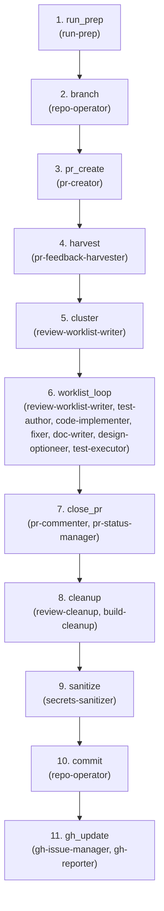

# Review — Harvest Feedback and Apply Fixes

**Goal:** Harvest PR feedback from bots and humans, cluster into actionable items, apply fixes in the shadow fork until work items are resolved.

**Question:** Is this work ready for gate review?

**Core Outputs:** `review_receipt.json`, `review_worklist.json`

---

## Artifact Paths

For a given run (`run-id`), define:

- `RUN_BASE = swarm/runs/<run-id>`

All artifacts for this flow are written under:

- `RUN_BASE/review/`

For example:

- `RUN_BASE/review/pr_feedback.md` — harvested bot/human feedback
- `RUN_BASE/review/review_worklist.json` — clustered work items
- `RUN_BASE/review/review_actions.md` — actions taken to resolve items
- `RUN_BASE/review/review_receipt.json` — final resolution summary

---

## Upstream Inputs

Flow 4 reads primarily from Flow 3 (`RUN_BASE/build/`):

- `build_receipt.json` — structured summary of Build state
- `pr_creation_status.md` — PR metadata (if created during Build)
- Code and test changes from Build

Flow 4 also reads from Flows 1-2 for context:

- `requirements.md` — what was required
- `adr.md` — architectural decisions
- `ac_matrix.md` — acceptance criteria

---

## How Review Differs from Gate

| Aspect | Review (Flow 4) | Gate (Flow 5) |
|--------|-----------------|---------------|
| **Purpose** | Fix issues | Audit compliance |
| **Action** | Apply changes | Verify contracts |
| **Output** | Resolved work items | Merge decision |
| **Role** | Worker | Auditor |

**Review fixes.** Gate audits. Review iterates until work items are resolved. Gate passes or bounces.

---

## Charter

```json
{
  "goal": "Resolve all blocking feedback items in the shadow fork",
  "exit_criteria": [
    "All CRITICAL and MAJOR work items resolved",
    "PR feedback processed and clustered into review_worklist.json",
    "pending_blocking count is 0",
    "review_receipt.json produced with resolution summary"
  ],
  "non_goals": [
    "Adding features not requested in feedback",
    "Fundamental design changes (bounce to Flow 2 if needed)",
    "Refactoring beyond what feedback explicitly requests",
    "Addressing INFO-level items if CRITICAL/MAJOR remain"
  ],
  "prime_directive": "Maximize issue resolution from feedback. Do not add unrequested features."
}
```

**Note:** PR status (Draft/Ready) is informational output, not a control mechanism. Flow 4 completes when work items are resolved, regardless of PR status.

---

<!-- FLOW AUTOGEN START -->
### Flow structure



### Steps

| # | Step | Agents | Role |
| - | ---- | ------ | ---- |
| 1 | `run_prep` | `run-prep` — Establish run directory and flow infrastructure. Creates RUN_BASE/<flow>/ structure. | Establish run directory and .runs/<run-id>/review/ infrastructure. |
| 2 | `branch` | `repo-operator` — Git workflows: branch, commit, merge, tag, reset operations. Safe Bash only. | Ensure run branch run/<run-id> exists and is current. |
| 3 | `pr_create` | `pr-creator` — Create Draft PR if missing. Idempotent: skips if PR already exists. | Ensure Draft PR exists; create if missing → pr_creation_status.md. |
| 4 | `harvest` | `pr-feedback-harvester` — Pull all bot/human feedback from PR. Non-blocking: returns what's available now. | Pull all bot/human feedback from PR → pr_feedback.md, pr_feedback_raw.json. |
| 5 | `cluster` | `review-worklist-writer` — Cluster PR feedback into actionable Work Items with stable RW-NNN IDs. | Cluster feedback into actionable Work Items → review_worklist.md, review_worklist.json. |
| 6 | `worklist_loop` | `review-worklist-writer` — Cluster PR feedback into actionable Work Items with stable RW-NNN IDs.<br>`test-author` — Write/update tests → tests/*, test_changes_summary.md.<br>`code-implementer` — Write code to pass tests, following ADR → src/*, impl_changes_summary.md.<br>`fixer` — Apply targeted fixes from critics/mutation → fix_summary.md.<br>`doc-writer` — Update inline docs, READMEs, API docs → doc_updates.md.<br>`design-optioneer` — Propose 2-3 architecture options with trade-offs → design_options.md.<br>`test-executor` — Execute test suites to verify fixes. Uses test-runner skill. | Unbounded microloop: pull next batch, route to fix-lane agent, update worklist, checkpoint, repeat until complete. |
| 7 | `close_pr` | `pr-commenter` — Post idempotent summary comments to PR. Updates existing comments.<br>`pr-status-manager` — Flip Draft PR to Ready when review complete. Keeps Draft if incomplete. | Post resolution checklist to PR, flip Draft to Ready if complete. |
| 8 | `cleanup` | `review-cleanup` — Write review_receipt.json and finalize review artifacts. Update run index.<br>`build-cleanup` — Reseal build receipt if code changed during review. Update checksums. | Write review_receipt.json, reseal build receipt, update index. |
| 9 | `sanitize` | `secrets-sanitizer` — Scan staged surface for secrets. Emit Gate Result (safe_to_commit, safe_to_publish). | Publish gate: scan for secrets/hygiene → secrets_scan.md, secrets_status.json. |
| 10 | `commit` | `repo-operator` — Git workflows: branch, commit, merge, tag, reset operations. Safe Bash only. | Commit and push changes (gated on secrets-sanitizer). |
| 11 | `gh_update` | `gh-issue-manager` — Update GitHub issue board. Link PRs to issues, update labels and status.<br>`gh-reporter` — Post summaries to GitHub issues/PRs at flow boundaries. | Update issue board, post summary to GitHub (gated on proceed_to_github_ops). |
<!-- FLOW AUTOGEN END -->

### The Worklist Loop

The core of Flow 4 is the **worklist_loop**—an unbounded microloop that:

1. Reads work items from `review_worklist.json`
2. Routes to appropriate fix-lane agent (test-author, code-implementer, fixer, doc-writer)
3. Updates work item status
4. Checkpoints (commit/push)
5. Re-harvests feedback
6. Repeats until `pending_blocking == 0`

Exit conditions:
- All CRITICAL/MAJOR items resolved
- Context exhaustion (checkpoint first)
- Stuck signal (checkpoint first)

---

## Downstream Contract

Flow 4 is "complete for this run" when these exist:

- `pr_feedback.md` — all harvested feedback
- `review_worklist.json` — work items with resolution status
- `review_actions.md` — actions taken
- `review_receipt.json` — final receipt

Flow 5 (Gate) proceeds when Review completes with `pending_blocking == 0`.

---

## Off-Road Policy

**Justified detours:**
- DETOUR to run additional tests when feedback questions coverage
- DETOUR to lint-fix when style feedback is clustered
- INJECT_NODES for targeted security fix if reviewer flags vulnerability
- Loop back to harvest when new feedback arrives mid-resolution

**Not justified:**
- INJECT_FLOW to wisdom before review is complete
- Design changes without explicit reviewer request
- Expanding scope to address nice-to-have suggestions
- Ignoring blocking feedback to accelerate merge

---

## Shadow Fork Model

Flow 4 operates entirely within the shadow fork:

- All fixes are applied in the isolated fork
- PR feedback is harvested as input, but PR status doesn't control flow
- Work completion is determined by `pending_blocking == 0`, not PR state
- Flow 5 (Gate) decides merge-worthiness based on evidence, not PR status

PR status may be updated as a **communication signal** to upstream maintainers, but this is informational output, not a gate.

---

## See Also

- [flow-build.md](./flow-build.md) — Upstream: creates the Draft PR
- [flow-gate.md](./flow-gate.md) — Downstream: audits and decides merge
- `swarm/config/flows/review.yaml` — Full step configuration
