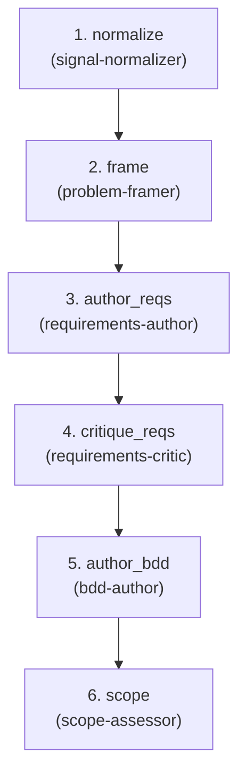

# Signal — Input → Spec

**Goal:** Transform raw input into testable requirements—shape the problem, identify stakeholders, flag early risks, estimate scope.

**Question:** What problem, for whom, under which constraints?

**Core Outputs:** `requirements.md`, `features/*.feature`, `early_risks.md`, `scope_estimate.md`

---

## Artifact Paths

For a given run (`run-id`), define:

- `RUN_BASE = swarm/runs/<run-id>`

All artifacts for this flow are written under:

- `RUN_BASE/signal/`

For example:

- `RUN_BASE/signal/issue_normalized.md`
- `RUN_BASE/signal/context_brief.md`
- `RUN_BASE/signal/problem_statement.md`
- `RUN_BASE/signal/clarification_questions.md`
- `RUN_BASE/signal/requirements.md`
- `RUN_BASE/signal/requirements_critique.md`
- `RUN_BASE/signal/features/*.feature`
- `RUN_BASE/signal/example_matrix.md`
- `RUN_BASE/signal/stakeholders.md`
- `RUN_BASE/signal/early_risks.md`
- `RUN_BASE/signal/scope_estimate.md`

---

## Upstream Inputs

Flow 1 is the entry point. It receives:

- Raw ticket/PR description/user request
- Optional: linked issues/PRs, chat threads, incident references
- Codebase context (orchestrator may use `explore` to pre-gather)

---

## Orchestration Model

Flow specs describe **what** happens; the orchestrator (top-level Claude)
decides **how** to invoke agents.

### Two Execution Levels

1. **Orchestrator (top-level Claude)**:
   - Can call all agents: built-in (`explore`, `plan-subagent`,
     `general-subagent`) and domain (`.claude/agents/*.md`)
   - Interprets agent outputs (status, recommended_next) to decide routing
   - Controls requirements microloop iteration
   - May use `explore` to gather context before invoking domain agents

2. **All Agents** (signal-normalizer, problem-framer, etc.):
   - Inherit full tooling from the main Claude Code session (Read, Write, Glob, Grep, Bash)
   - Can optionally restrict to specific skills via `skills:` frontmatter; behavior is constrained by prompts
   - Currently cannot call other agents (Claude Code limitation, not design)
   - Read inputs from files, write outputs to files

### Context Gathering Pattern

Before invoking `signal-normalizer`, the orchestrator MAY:

- Call `explore` to locate related issues/PRs in `swarm/runs/`
- Call `explore` to find relevant code areas mentioned in the raw input
- Pass discovered file paths as context to the subagent

The subagent then uses its own tools (Glob, Grep, Read) on those specific
paths.

---

## Downstream Contract

Flow 1 is "complete for this run" when these exist (even if imperfect):

- `issue_normalized.md` — structured summary of the raw signal
- `context_brief.md` — related history and context
- `problem_statement.md` — goals, non-goals, constraints
- `clarification_questions.md` — open questions and assumptions
- `requirements.md` — functional + non-functional requirements with IDs
- `requirements_critique.md` — verdict on requirements quality
- `features/*.feature` — BDD scenarios (Gherkin)
- `stakeholders.md` — teams, systems, users affected
- `early_risks.md` — first-pass risk identification
- `scope_estimate.md` — S/M/L/XL estimate with rationale

Flows 2–6 treat these as the "Signal spec" and depend on them.

---

## Output Semantics: Assumptions + Questions

Every agent in Flow 1 must emit explicit assumptions and questions in their output artifacts.

### Mandatory Output Sections

**For `requirements.md`:**
```markdown
## Assumptions Made to Proceed
- Assumption: [what] → [why] → [impact if wrong]

## Questions / Clarifications Needed
- Question: [what] → [default answer] → [impact if different]
```

**For `problem_statement.md`:**
```markdown
## Assumptions Made
- Assumption: [what] → [why]
```

**For `clarification_questions.md`:**
```markdown
## Questions That Would Change the Spec
- Question with current assumption and impact if different

## Assumptions Made to Proceed
- Assumption with rationale
```

### Philosophy

1. **Assumptive-but-transparent**: When facing ambiguity, make a reasonable assumption, document it, and proceed. Never block waiting for clarification.

2. **Questions are logged, not blocking**: `clarification_questions.md` surfaces what a human could answer at the flow boundary. The flow continues regardless.

3. **Re-run friendly**: Flow 1 is designed to be re-run with better inputs. When humans answer questions, re-running produces refined output. Agents don't need human answers mid-flow.

4. **BLOCKED is exceptional**: Only use BLOCKED when input artifacts are missing. Ambiguity is not BLOCKED; it's UNVERIFIED with documented assumptions.

---

## Agents (6 domain + cross-cutting)

| Agent | Category | Responsibility |
|-------|----------|----------------|
| signal-normalizer | shaping | Parse raw input, find related context → `issue_normalized.md`, `context_brief.md` |
| problem-framer | shaping | Synthesize normalized signal → `problem_statement.md` |
| requirements-author | spec | Write functional + non-functional requirements → `requirements.md` |
| requirements-critic | critic | Verify testable, consistent → `requirements_critique.md`. Never fixes. |
| bdd-author | spec | Turn requirements into BDD → `features/*.feature`, `example_matrix.md` |
| scope-assessor | analytics | Stakeholders, risks, T-shirt size → `stakeholders.md`, `early_risks.md`, `scope_estimate.md` |

**Cross-cutting used:** clarifier, risk-analyst, gh-reporter

---

<!-- FLOW AUTOGEN START -->
### Flow structure



### Steps

| # | Step | Agents | Role |
| - | ---- | ------ | ---- |
| 1 | `normalize` | `signal-normalizer` — Parse raw input, find related context → issue_normalized.md, context_brief.md. | Parse raw input, find related context → issue_normalized.md, context_brief.md. |
| 2 | `frame` | `problem-framer` — Synthesize normalized signal → problem_statement.md. | Synthesize normalized signal → problem_statement.md with clear success criteria. |
| 3 | `author_reqs` | `requirements-author` — Write functional + non-functional requirements → requirements.md. | Write functional + non-functional requirements → requirements.md following structured template. |
| 4 | `critique_reqs` | `requirements-critic` — Verify requirements are testable, consistent → requirements_critique.md. | Harsh review of requirements vs completeness, feasibility, testability → requirements_critique.md. |
| 5 | `author_bdd` | `bdd-author` — Turn requirements into BDD scenarios → features/*.feature. | Turn verified requirements into executable BDD scenarios → features/*.feature. |
| 6 | `scope` | `scope-assessor` — Stakeholders, risks, T-shirt size → stakeholders.md, early_risks.md, scope_estimate.md. | Assess stakeholders, constraints, risks, effort estimate → scope_assessment.md. |
<!-- FLOW AUTOGEN END -->

---

## Orchestration Strategy

Flow 1 has one local microloop and is otherwise linear.

### Requirements Microloop

The orchestrator should:
1. Call `requirements-author` to draft requirements.
2. Call `requirements-critic` to review them.
3. If `requirements-critic.status == VERIFIED`:
   - Proceed to `bdd-author` and `scope-assessor`.
4. If `requirements-critic.status == UNVERIFIED` with `can_further_iteration_help: yes`:
   - Route back to `requirements-author` with the critique and iterate.
5. If `requirements-critic.status == UNVERIFIED` with `can_further_iteration_help: no`:
   - Proceed to `bdd-author` and `scope-assessor` (accept the limitations; critic has judged no viable fix path exists within scope/constraints).

**Important:** Agents don't know they're in a loop. They just:
- Read their inputs
- Write their outputs
- Set a `status` (VERIFIED/UNVERIFIED/BLOCKED)
- Optionally suggest `recommended_next` agents

The orchestrator interprets these signals to decide routing.

### Clarifier Behavior

`clarifier` is non-blocking:
- Runs after `problem-framer` to surface ambiguities
- Questions land in `clarification_questions.md`
- Flow continues regardless; humans answer at flow boundary

Downstream agents (in Flows 2–6) may discover answers to clarification questions from code, docs, or other artifacts—and update the relevant artifacts without human intervention. Questions are logged, not blocking.

---

## Status States

Agents set status in their output artifacts:

- **VERIFIED** — Work is adequate for its purpose; assumptions documented.
- **UNVERIFIED** — Work has issues; here are concrete concerns and assumptions made.
- **BLOCKED** — Required input artifacts missing (exceptional; NOT for ambiguity).

**Key rule**: If you can read your inputs and form an opinion, you are VERIFIED or UNVERIFIED, never BLOCKED. Ambiguity uses documented assumptions, not BLOCKED status.

`requirements-critic` uses these states in `requirements_critique.md`. The orchestrator uses status to decide whether to loop or proceed.

---

## Rerun Semantics

Flow 1 can be re-run on the same `run-id`:
- When Flow 4 or 6 reveals the problem was misframed
- When humans answer clarification questions
- When new context emerges

Agents are written as "update and refine existing artifacts" rather than "start from scratch":
- `signal-normalizer` reads existing `issue_normalized.md` and evolves it
- `requirements-author` reads existing `requirements.md` and improves it
- Downstream flows see updated specs on next run

Re-running Flow 1 is "sharpen the spec", not "start over."

---

## Notes

- Human gate at end: "Is this the right problem to solve?"
- This flow is the first attention reducer: bound scope, clarify early,
  produce context downstream flows consume.
- Agents never block; they document concerns in receipts and continue.
- Flow 1 sets the **gravity well** for everything else. Requirements IDs
  (REQ-001, etc.) thread through tests, coverage, Gate, and Wisdom.

---

## Out-of-the-Box Implementation

This flow uses **only local files and git**:

- Read/write artifacts to `RUN_BASE/signal/`
- Orchestrator may use `explore` for broad codebase search
- Subagents use Glob/Grep/Read directly on specific paths
- No external services required

Works immediately on clone.

