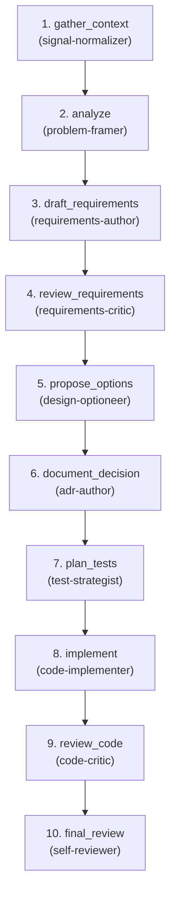

# Stepwise Demo (Utility)

**Goal:** Provide a controlled 10-step demo flow for testing stepwise execution backends.

**Question:** Does the stepwise engine correctly execute each step, pass context, and manage state?

**Core Outputs:** Context artifacts at each step demonstrating successful execution.

---

## Artifact Paths

For a given run (`run-id`), define:

- `RUN_BASE = swarm/runs/<run-id>`

All artifacts for this flow are written under:

- `RUN_BASE/stepwise-demo/`

For example:

- `RUN_BASE/stepwise-demo/context.md`
- `RUN_BASE/stepwise-demo/problem_statement.md`
- `RUN_BASE/stepwise-demo/requirements.md`
- `RUN_BASE/stepwise-demo/requirements_review.md`
- `RUN_BASE/stepwise-demo/design_options.md`
- `RUN_BASE/stepwise-demo/adr.md`
- `RUN_BASE/stepwise-demo/test_strategy.md`
- `RUN_BASE/stepwise-demo/implementation.md`
- `RUN_BASE/stepwise-demo/code_review.md`
- `RUN_BASE/stepwise-demo/final_review.md`

---

## Upstream Inputs

This is a demo flow for testing. It can receive:

- Any raw input to exercise the execution pipeline
- Optional: test parameters for specific backend validation

---

## Orchestration Model

Flow specs describe **what** happens; the orchestrator (top-level Claude)
decides **how** to invoke agents.

### Two Execution Levels

1. **Orchestrator (top-level Claude)**:
   - Can call all agents: built-in (`explore`, `plan-subagent`,
     `general-subagent`) and domain (`.claude/agents/*.md`)
   - Interprets agent outputs (status, recommended_next) to decide routing
   - May use `explore` to gather context before invoking domain agents

2. **All Agents** (signal-normalizer, problem-framer, etc.):
   - Inherit full tooling from the main Claude Code session (Read, Write, Glob, Grep, Bash)
   - Currently cannot call other agents (Claude Code limitation, not design)
   - Read inputs from files, write outputs to files

---

## Downstream Contract

Flow 7 is "complete for this run" when all 10 steps have executed successfully.
This flow is primarily for testing backend execution, so the artifacts serve
as verification that each step ran correctly.

---

## Agents (10 domain + cross-cutting)

| Agent | Category | Responsibility |
|-------|----------|----------------|
| signal-normalizer | shaping | Gather and normalize input context |
| problem-framer | shaping | Analyze context and frame the problem |
| requirements-author | spec | Draft requirements based on the analysis |
| requirements-critic | critic | Review requirements for completeness |
| design-optioneer | design | Propose design options |
| adr-author | design | Document the architectural decision |
| test-strategist | planning | Plan the test strategy |
| code-implementer | build | Implement the solution |
| code-critic | critic | Review the implementation |
| self-reviewer | review | Perform final review |

**Cross-cutting used:** clarifier, gh-reporter

---

<!-- FLOW AUTOGEN START -->
### Flow structure

### Steps

| # | Step | Agents | Role |
| - | ---- | ------ | ---- |
| 1 | `gather_context` | `signal-normalizer` — Parse raw input, find related context → issue_normalized.md, context_brief.md. | Gather and normalize input context for the demo workflow. |
| 2 | `analyze` | `problem-framer` — Synthesize normalized signal → problem_statement.md. | Analyze the gathered context and frame the problem statement. |
| 3 | `draft_requirements` | `requirements-author` — Write functional + non-functional requirements → requirements.md. | Draft functional and non-functional requirements based on the analysis. |
| 4 | `review_requirements` | `requirements-critic` — Verify requirements are testable, consistent → requirements_critique.md. | Review requirements for completeness and testability. |
| 5 | `propose_options` | `design-optioneer` — Propose 2-3 architecture options with trade-offs → design_options.md. | Propose design options based on validated requirements. |
| 6 | `document_decision` | `adr-author` — Write ADR for chosen design → adr.md. | Document the architectural decision in ADR format. |
| 7 | `plan_tests` | `test-strategist` — Map BDD scenarios to test types → test_plan.md. | Plan the test strategy and coverage approach. |
| 8 | `implement` | `code-implementer` — Write code to pass tests, following ADR → src/*, impl_changes_summary.md. | Implement the solution according to the ADR and test plan. |
| 9 | `review_code` | `code-critic` — Harsh review vs ADR/contracts → code_critique.md. | Review the implementation for ADR compliance and quality. |
| 10 | `final_review` | `self-reviewer` — Final review → self_review.md, build_receipt.json. | Perform final review and generate build receipt. |
<!-- FLOW AUTOGEN END -->

---

## Orchestration Strategy

Flow 7 is a linear sequence with no microloops. Each step executes in order,
passing context to the next step.

This simplicity is intentional - the flow is designed to test stepwise
execution backends, not complex orchestration logic.

---

## Status States

Agents set status in their output artifacts:

- **VERIFIED** - Work is adequate for its purpose; here's why.
- **UNVERIFIED** - Work has issues; here are concrete concerns.
- **BLOCKED** - Couldn't meaningfully complete; here's what's missing.

---

## Notes

- This flow is designed for testing stepwise execution backends
- All 10 agents are existing agents from the agent pool
- The flow exercises a variety of agent types: shaping, spec, critic, design, planning, build, review
- No microloops or complex routing - pure linear execution
- Useful for validating backend state management and context passing

---

## Out-of-the-Box Implementation

This flow uses **only local files and git**:

- Read/write artifacts to `RUN_BASE/stepwise-demo/`
- Orchestrator may use `explore` for broad codebase search
- Subagents use Glob/Grep/Read directly on specific paths
- No external services required

Works immediately on clone.
