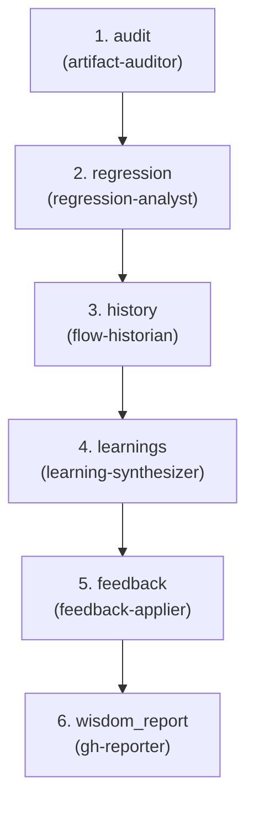

# Wisdom — Prod → Learnings

**Goal:** Analyze artifacts, detect regressions, extract learnings,
close feedback loops—treat receipts as observability.

**Question:** What did we learn?

**Core Outputs:** `learnings.md`, `feedback_actions.md`

---

## Artifact Paths

For a given run (`run-id`), define:

- `RUN_BASE = swarm/runs/<run-id>`

All artifacts for this flow are written under:

- `RUN_BASE/wisdom/`

For example:

- `RUN_BASE/wisdom/artifact_audit.md`
- `RUN_BASE/wisdom/regression_report.md`
- `RUN_BASE/wisdom/flow_history.json`
- `RUN_BASE/wisdom/learnings.md`
- `RUN_BASE/wisdom/feedback_actions.md`

---

## Upstream Inputs

Flow 6 reads from **all previous flows** for this `run-id`:

From Flow 1 (`signal/`):

- `problem_statement.md` — original intent
- `requirements.md`, `requirements_critique.md` — what we wanted
- `features/*.feature` — expected behaviors
- `early_risks.md` — predicted risks
- `scope_estimate.md` — size prediction

From Flow 2 (`plan/`):

- `adr.md` — architectural decisions
- `design_options.md` — alternatives considered
- `api_contracts.yaml`, `schema.md` — contracts
- `test_plan.md` — expected test coverage
- `design_validation.md` — design assessment

From Flow 3 (`build/`):

- `build_receipt.json` — Build state
- `test_changes_summary.md`, `test_critique.md` — test quality
- `impl_changes_summary.md`, `code_critique.md` — code quality
- `mutation_report.md` — test strength

From Flow 4 (`gate/`):

- `merge_decision.md` — Gate verdict
- `receipt_audit.md`, `contract_compliance.md` — verifications
- `security_scan.md`, `coverage_audit.md` — checks

From Flow 5 (`deploy/`):

- `deployment_decision.md` — deployment outcome
- `verification_report.md` — CI + smoke results

Plus (optional):

- `RUN_BASE/build/selftest_report.json` (from swarm selftest) — governance health at build time
  - If present, Wisdom may correlate selftest failures with regressions or chronic governance issues
  - See `swarm/examples/swarm-selftest-baseline/` for example structure
  - Ignored if absent (selftest is optional for demo runs)

Plus:

- Git history around the change
- GitHub issues/PRs via `gh` CLI

---

## Orchestration Model

Flow specs describe **what** happens; the orchestrator (top-level
Claude) decides **how** to invoke agents.

### Two Execution Levels

1. **Orchestrator (top-level Claude)**:
   - Can call all agents: built-in (`explore`, `plan-subagent`,
     `general-subagent`) and domain (`.claude/agents/*.md`)
   - Interprets agent outputs to build comprehensive analysis
   - May use `explore` to locate artifacts across all flow directories

2. **All Agents** (artifact-auditor, regression-analyst, etc.):
   - Use tools declared in their frontmatter (Read, Write, Glob, Grep, Bash)
   - Currently cannot call other agents (Claude Code limitation, not design)
   - Interact with GitHub via `gh` CLI tool

### Linear Pipeline

Flow 6 is linear—no microloops. The orchestrator invokes agents in
sequence:

artifact-auditor → regression-analyst → flow-historian →
learning-synthesizer → feedback-applier → gh-reporter

---

## Downstream Contract

Flow 6 is "complete for this run" when these exist:

- `artifact_audit.md` — structural sanity check of all flows
- `regression_report.md` — what got worse and where
- `flow_history.json` — timeline linking all flow events
- `learnings.md` — narrative lessons extracted
- `feedback_actions.md` — concrete follow-ups (issues, doc updates,
  template changes)

Flow 6 is the **back edge** of the SDLC loop. Its outputs feed future
runs of Flows 1–3.

---

## Agents (5 domain + cross-cutting)

| Agent | Category | Responsibility |
|-------|----------|----------------|
| artifact-auditor | verify | Verify artifacts exist → `artifact_audit.md` |
| regression-analyst | analytics | Test/coverage analysis → `regression_report.md` |
| flow-historian | analytics | Compile timeline → `flow_history.json` |
| learning-synthesizer | analytics | Extract lessons → `learnings.md` |
| feedback-applier | analytics | Create issues, updates → `feedback_actions.md` |

**Cross-cutting used:** risk-analyst, gh-reporter

---

<!-- FLOW AUTOGEN START -->
### Flow structure



### Steps

| # | Step | Agents | Role |
| - | ---- | ------ | ---- |
| 1 | `audit` | `artifact-auditor` — Verify all expected artifacts from Flows 1-5 exist | Verify all expected artifacts from Flows 1-5 exist → artifact_audit.md. |
| 2 | `regression` | `regression-analyst` — Tests, coverage, issues, blame → regression_report.md. | Analyze tests, coverage, issues, blame for regressions → regression_report.md. |
| 3 | `history` | `flow-historian` — Compile timeline → flow_history.json. | Compile timeline of all flow activity → flow_history.json with timestamps and decisions. |
| 4 | `learnings` | `learning-synthesizer` — Extract lessons from receipts, critiques → learnings.md. | Extract lessons from receipts and critiques → learnings.md with patterns and recommendations. |
| 5 | `feedback` | `feedback-applier` — Create issues, suggest doc updates → feedback_actions.md. | Create issues and suggest documentation updates → feedback_actions.md. |
| 6 | `wisdom_report` | `gh-reporter` — Post summaries to GitHub issues/PRs at flow boundaries. | Post wisdom summary to PR/issue to close the loop. |
<!-- FLOW AUTOGEN END -->

---

## Orchestration Strategy

Flow 6 is a **linear pipeline** with no internal loops.

### Execution Order

1. **artifact-auditor**:
   - Walk all `RUN_BASE/<flow>/` directories
   - Check expected artifacts against flow specs
   - Produce `artifact_audit.md` with matrix of flows vs artifacts

2. **regression-analyst**:
   - Read test outputs, coverage reports, deployment results
   - Correlate with GitHub issues and git blame
   - Produce `regression_report.md` with findings by type and severity

3. **flow-historian**:
   - Read all artifacts and git history
   - Build `flow_history.json` timeline linking signal → spec →
     design → build → gate → deploy
   - Include timestamps, commits, decision points

4. **learning-synthesizer**:
   - Read artifact audit, regression report, flow history
   - Extract patterns: what worked, what didn't, assumptions that broke
   - Produce `learnings.md` narrative

5. **feedback-applier**:
   - Turn learnings into concrete actions
   - Produce `feedback_actions.md` with actionable items
   - Optionally create GitHub issues for test gaps

6. **risk-analyst** (cross-cutting):
   - Add risk perspective to learnings
   - Compare predicted risks (early_risks.md) vs actual outcomes

7. **gh-reporter**:
   - Post mini-postmortem summary to PR/issue

### No Internal Loops

Flow 6 is pure analysis. If you want deeper analysis, re-run Flow 6
with more data (e.g., after an incident).

---

## Closed Feedback Loops

Flow 6 closes the SDLC loop by feeding learnings back
(recommendations, not direct calls):

### → Flow 1 (Signal)

- `learning-synthesizer` extracts problem patterns
- `feedback-applier` suggests updates to requirement templates
- Builds institutional memory of "problems that recur"

### → Flow 2 (Plan)

- `feedback-applier` suggests architecture doc updates
- Documents patterns that worked/failed
- Improves design templates and ADR prompts

### → Flow 3 (Build)

- `feedback-applier` creates GitHub issues for test gaps
- Links regression failures to coverage gaps
- Suggests test pattern improvements

These are **recommendations in artifacts**, not direct flow
invocations. Humans decide which to act on.

---

## Artifact Structures

### Artifact Audit

`artifact_audit.md` should include:

```markdown
# Artifact Audit

## Summary

- Flows 1-5 artifacts: 85% present
- Missing: build/mutation_report.md (mutator did not run)

## Matrix

| Flow | Artifact | Status | Notes |
|------|----------|--------|-------|
| signal | requirements.md | present | |
| signal | features/*.feature | present | 3 scenarios |
| plan | adr.md | present | |
| build | build_receipt.json | present | tests.status = VERIFIED |
| build | mutation_report.md | missing | mutator NOT_RUN |
| gate | merge_decision.md | present | decision = MERGE |
| deploy | deployment_decision.md | present | status = STABLE |
```

### Flow History

`flow_history.json` should include:

```json
{
  "run_id": "ticket-123",
  "events": [
    {
      "t": "2025-11-24T10:15:00Z",
      "flow": "signal",
      "type": "requirements_finalized",
      "artifacts": ["requirements.md"],
      "details": { "req_ids": ["REQ-001", "REQ-002"] }
    },
    {
      "t": "2025-11-25T13:42:00Z",
      "flow": "plan",
      "type": "adr_approved",
      "artifacts": ["adr.md"],
      "commit": "abc123"
    },
    {
      "t": "2025-11-26T01:02:00Z",
      "flow": "gate",
      "type": "merge_decision",
      "artifacts": ["merge_decision.md"],
      "details": { "decision": "MERGE" }
    },
    {
      "t": "2025-11-26T02:30:00Z",
      "flow": "deploy",
      "type": "deployment_decision",
      "artifacts": ["deployment_decision.md"],
      "details": { "status": "STABLE" }
    }
  ]
}
```

### Feedback Actions

`feedback_actions.md` should include:

```markdown
# Feedback Actions

## Flow 1 – Signal/Spec

- [ ] Update requirements template to include "external integration
      assumptions" section
  - Rationale: Missed risk in REQ-004 (Stripe API assumptions)

## Flow 2 – Design

- [ ] Add ADR guideline about "considering rate limit behavior" for
      third-party services
  - Rationale: Design did not account for bursty traffic

## Flow 3 – Build

- [ ] Create GH issue: Missing tests for REQ-004 negative cases
- [ ] Create GH issue: Retry logic for auth token refresh needs
      coverage
```

---

## Rerun Semantics

Flow 6 can be re-run on the same `run-id`:

- After an incident surfaces (to correlate with this change)
- When more data becomes available (metrics, logs, user reports)
- For periodic retrospectives

Agents append to or refine existing artifacts:

- `regression-analyst` can add new findings
- `learning-synthesizer` can update learnings with new context
- `flow_history.json` can gain new events

Re-running Flow 6 is "deepen the analysis", not "start over."

---

## Notes

- Human gate at end: "What did we learn? Should we keep this deployed?"
- Consolidates analysis into fewer agents (regression-analyst does
  what 4 agents previously did)
- Feedback is recommendations, not direct flow invocations
- Agents never block; if analysis incomplete, document concerns and
  continue
- Multi-path completion: agents report what they found, even if partial
- Flow 6 is the **memory** of the SDLC; its outputs accumulate over
  time

---

## Out-of-the-Box Implementation

The GitHub-native implementation uses **only artifacts and git/GitHub**:

- Walk RUN_BASE directories to audit artifacts
- Parse test output logs from Flow 3
- Compare coverage trends (if coverage tools ran)
- Correlate with GitHub issues via `gh issue list`
- Detect regressions via git blame + test failures
- Create GitHub issues for test gaps
- Post summary to PR/issue

No external observability platform required. Works immediately on clone.

---

## Production Extension Points

See `swarm/infrastructure/flow-6-extensions.md` for how to wire:

- Real metrics (Prometheus, Datadog)
- Real logs (ELK, Splunk)
- Real traces (Jaeger, Honeycomb)
- Real incidents (PagerDuty, Opsgenie)
- SLO calculations from live metrics

Extensions add environment variable detection; baseline works with
artifacts only.

